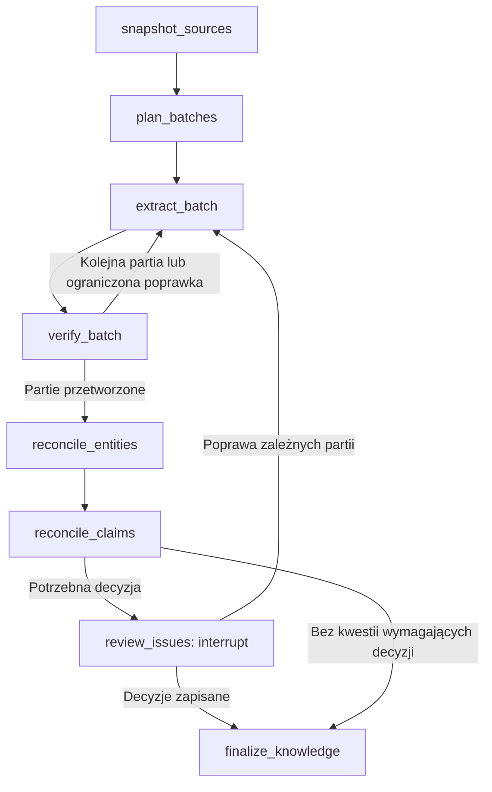

# Notes

Robocze notatki z rozmów o pipeline. Zapisują kontekst decyzji i pomysły do dalszego omówienia; aktualny zakres implementacji określa [development-plan.md](development-plan.md), a zasady kodu [AGENTS.md](../AGENTS.md).

## Cel i odbiorca

- Wejście: wiele starych plików Markdown oraz szablon nowej dokumentacji dostarczony przez użytkownika.
- Wyjście: dokumentacja zgodna z szablonem, przeznaczona dla osoby biegłej w domenie ubezpieczeniowej, lecz nieznającej szczegółów opisywanego oprogramowania.
- Odbiorca powinien rozumieć rozwiązanie bez ciągłego powtarzania tych samych definicji. Pojęcia, aktorzy i usługi mogą mieć wspólne strony referencyjne.
- Jeszcze nie ustalono, czy wynik będzie jednym dokumentem, zbiorem rozdziałów czy serwisem dokumentacyjnym. Nie widzieliśmy jeszcze konkretnego szablonu.

## Skala i sposób pracy ze źródłami

- Cały korpus będzie miał więcej niż milion tokenów. Nie zakładamy modelu z większym oknem kontekstowym ani pojedynczego wywołania z całym korpusem.
- Użytkownik preferuje system podziału z zachowaniem kontekstu zamiast RAG lub bazy wektorowej jako głównej architektury.
- Najpierw należy rozpoznać strukturę Markdown: nagłówki, akapity, listy, tabele, linki i inne istotne bloki. Zbyt duże sekcje dzielimy dalej.
- Partia powinna zachować ścieżkę nagłówków, potrzebne definicje, nagłówki tabel, pobliskie odsyłacze i zakres źródła. Zależności między partiami i dokumentami wymagają jawnego zapisu.
- Krótkie mapy dokumentów lub tematów mogą pomóc planować przebiegi modelu, lecz nie mogą zastąpić oryginalnych fragmentów jako podstawy faktów.
- Rozmiar partii powinien zostawiać zapas na instrukcję, dodatkowy kontekst i odpowiedź modelu. Warto go konfigurować i mierzyć na rzeczywistym korpusie.
- Inwentarz powinien ujawniać problemy z odczytem, brakujące pliki i zepsute odsyłacze. Migawki wejścia powinny być niezmienne i identyfikowane ścieżką oraz wersją lub skrótem treści.

## Zachowanie informacji i pochodzenie

- Użytkownik szczególnie podkreśla zachowanie *wszystkich istotnych informacji* przy przenoszeniu treści. System ma też pokazywać informacje nierozstrzygnięte i miejsca, których nie zdołał pewnie odczytać.
- Informacje warto wydobywać jako małe, sprawdzalne stwierdzenia. Rekord może zawierać: treść, aktora lub obiekt, działanie, warunki, częstotliwość lub czas, wyjątki, zakres obowiązywania, oryginalne sformułowanie i źródło. Brakujących pól nie należy dopowiadać.
- Przykład użytkownika: „Jako administrator chcę, aby zapis polis odbywał się cyklicznie raz dziennie”. Trzeba zachować aktora, zapis polis, cykliczność i częstotliwość **raz dziennie**. Sformułowanie życzenia nie potwierdza samo w sobie, że system już tak działa; nie określa też godziny zapisu.
- Pochodzenie rekordu powinno obejmować identyfikator migawki, plik, sekcję, lokalizację (np. wiersze) i dokładny fragment źródła. W tabelach potrzebny jest wiersz wraz z nagłówkami kolumn. Odsyłacze wygenerowane przez model należy sprawdzać w kodzie.
- Docelowo czytelnik lub recenzent ma móc przejść od fragmentu nowej dokumentacji przez wydobytą informację do konkretnego pliku i miejsca w starej dokumentacji.
- Rejestr pokrycia powinien nadawać status każdemu odczytanemu blokowi: reprezentowany, powtórzony, świadomie pominięty z uzasadnieniem lub nierozstrzygnięty. Kontrola identyfikatorów i kompletności rejestru nie zastąpi oceny, czy znaczenie fragmentu zostało wiernie zachowane.

## Wspólna wiedza

- Potrzebny jest globalny słownik pojęć specyficznych dla systemu oraz rejestry aktorów, usług/systemów zewnętrznych, funkcji i ważnych relacji.
- Wpis powinien mieć nazwę kanoniczną, warianty nazw, definicję, zakres lub wersję, wskazania źródeł i stan przeglądu.
- Podobnych nazw nie należy scalać automatycznie bez potwierdzenia. Sprzeczne opisy częstotliwości, uprawnień czy znaczenia pojęcia trzeba zachować obok siebie z ich źródłami. Brakujące definicje i niejasne odniesienia są lukami do wyjaśnienia.
- Wspólny słownik ma ograniczyć powtarzanie definicji w finalnych rozdziałach. Osobny graf wiedzy lub baza grafowa pozostaje opcją; na początek mogą wystarczyć wersjonowane rekordy i jawne relacje.

## Późniejsze etapy i technologia

- Dopiero po zobaczeniu szablonu ustalimy szczegółowy sposób przypisywania informacji do jego części oraz zasady redakcji wynikowych rozdziałów.
- Trzeba określić, kto rozstrzyga sprzeczności, jak odbywa się przegląd człowieka i kiedy wynik można zatwierdzić do publikacji.
- Użytkownik chce logicznych etapów jako nodów LangGraph, trwałych checkpointów po etapach i `interrupt()` przy potrzebie informacji zwrotnej człowieka.
- Wybrane API: Gemini; wymagany model: `gemini-3.8-flash`. Streamlit jest opcją, jeśli późniejszy przegląd będzie wymagał interfejsu graficznego.
- Kod ma być wyłącznie po angielsku, bez komentarzy, bardzo czytelny i prosty. Wspólne funkcje logowania, konfiguracji, zapisu i odczytu należy centralizować; singleton może służyć do współdzielenia bezpiecznych, niezmiennych klientów, a nie zmiennego stanu przebiegu.
- Sekrety i ustawienia runtime będą czytane z `.env`; `.env.example` zawiera przykładowe nazwy zmiennych bez sekretów.

## Otwarte decyzje

- Dokładna struktura szablonu i format końcowy.
- Reguły hierarchii wiarygodności źródeł i rozstrzygania konfliktów.
- Sposób pomiaru pominięć oraz zniekształceń na próbce kontrolnej.
- Zakres i forma interfejsu do przeglądu.

## Propozycja doprecyzowania pipeline — 8 października 2026

Poniższe rozwiązania są rekomendacjami do omówienia, nie wynikami pomiarów. Największą korzyść przewiduję z pełnego przejścia po źródłach, weryfikacji wydobycia względem oryginału oraz osobnego uzgadniania informacji między dokumentami. Aktualny Development Plan pozostaje krótkim opisem zakresu.

### Proponowane nody i wyniki

| Node | Odpowiedzialność | Wynik |
| --- | --- | --- |
| `snapshot_sources` | Odczyt Markdown do bloków z lokalizacjami; zachowanie tabel, linków i wersji źródeł. | Migawka, inwentarz bloków i problemów odczytu. |
| `plan_batches` | Podział na fragment główny i kontekst pomocniczy; zaplanowanie przetworzenia wszystkich bloków. | Manifest partii, zależności i budżety tokenów. |
| `extract_batch` | Wydobycie stwierdzeń i innych treści wymagających zachowania, bez filtrowania ich według szablonu wyjściowego. | Rekordy ze wskazaniami źródeł i propozycją pokrycia. |
| `verify_batch` | Porównanie oryginału z rekordami: pominięcia, zniekształcenia i niepoparte dodatki. | Zaakceptowane rekordy albo konkretne uwagi do poprawy. |
| `reconcile_entities` | Uzgadnianie nazw, aktorów, usług i zakresów między partiami. | Wersjonowany rejestr pojęć i powiązań; niepewne dopasowania. |
| `reconcile_claims` | Porównanie informacji dotyczących tych samych obiektów i reguł. | Duplikaty, warianty, konflikty i brakujące zależności. |
| `review_issues` | Zebranie decyzji człowieka przez `interrupt()`. | Decyzje powiązane z wersją danych; ewentualne zadania ponownego przetworzenia. |
| `finalize_knowledge` | Kontrola pokrycia i zapis wersji wiedzy ze znanym stanem nierozstrzygniętych kwestii. | Dane do późniejszego planowania i pisania dokumentacji. |

`extract_batch` i `verify_batch` tworzą powtarzaną parę nodów, a nie pojedynczy node wykonujący setki wywołań w ukrytej pętli. Proponuję maksymalnie dwie poprawki partii; kolejne niepowodzenie zostaje widocznym problemem. Po wszystkich partiach następuje uzgadnianie globalne. Zmiana znaczenia pojęcia podczas uzgadniania może skierować do ponownego wydobycia tylko zależne partie.

### Podział z kontekstem

- Każdy blok ma jedną partię odpowiedzialną za jego pokrycie. Może też wystąpić jako kontekst w innych partiach; jego identyfikator pozostaje ten sam, co ogranicza duplikaty.
- Kontekst budujemy z hierarchii nagłówków, sąsiednich bloków, jawnych linków i zarejestrowanych wystąpień pojęć. Wszystkie bloki przechodzą przez ekstrakcję; indeks służy do zestawiania kontekstu i porównań, bez wyszukiwania top-k zastępującego pełny odczyt.
- Twierdzenie może mieć kilka fragmentów dowodowych, np. regułę w jednym miejscu i wyjątek w innym. Samodzielna, uproszczona trójka „aktor–czynność–obiekt” byłaby zbyt uboga dla tych danych.
- Globalny rejestr przechowujemy poza promptem. Do partii trafiają potrzebne wpisy wraz z wersjami i źródłami; nie kopiujemy całego słownika do każdego wywołania. Niedostępny kontekst lub przekroczony limit tworzy jawne zadanie do uzupełnienia.
- Limit odpowiedzi też ogranicza wielkość partii: drobiazgowy JSON może być obszerniejszy niż tekst źródłowy. Proponowany eksperyment to partie po 8, 16 i 32 tys. tokenów głównej treści, z oddzielnym budżetem kontekstu i odpowiedzi. To wartości do porównania, nie ustalone optimum. Ucięta odpowiedź oznacza ponowną próbę z mniejszą partią.

Gemini 3.8 Flash udostępnia okno 1M tokenów i odpowiedź do 64k tokenów; przed żądaniem można policzyć tokeny wejścia przez API. Wielkość partii należy dobierać według jakości i gęstości informacji, a nie maksymalnego okna. [Specyfikacja modelu — Google](https://ai.google.dev/gemini-api/docs/latest-model), [liczenie tokenów — Google](https://ai.google.dev/gemini-api/docs/tokens).

### Kontrola informacji

Najważniejsze rozróżnienie: pokrycie bloków mierzy, czy przetworzyliśmy materiał; nie dowodzi kompletności znaczenia. Dlatego osobny prompt weryfikujący czyta oryginał i wynik, szukając brakujących warunków, wyjątków, liczb, jednostek, negacji, kolejności kroków oraz rozróżnienia wymagania od opisu wdrożonej funkcji. Tabele, przykłady i procedury zachowujemy także jako bloki źródłowe, aby atomizacja nie zniszczyła ich układu i sensu.

Kod sprawdza poprawność identyfikatorów, zgodność cytatów i kompletność rejestru. Model ocenia zgodność znaczenia. Drugi przebieg tego samego modelu nadal może popełnić ten sam błąd; potrzebna jest ręcznie opisana próbka odniesienia. Gemini obsługuje odpowiedzi zgodne z JSON Schema oraz schematy Pydantic, co warto wykorzystać do struktury rekordów. Poprawny format sam nie stanowi dowodu zgodności ze źródłem. [Structured outputs — Google](https://ai.google.dev/gemini-api/docs/structured-output).

Przy uzgadnianiu porównujemy paczki według obiektu, reguły, zakresu i wersji. Przykładowo różne częstotliwości dla dwóch produktów nie muszą być konfliktem. Zbyt dużych grup nie streszczamy do jednego tekstu: dzielimy porównania, zachowujemy oryginalne rekordy i uwzględniamy powiązania między podgrupami. Samo grupowanie po nazwach może przeoczyć nieznane synonimy, dlatego potrzebny jest dodatkowy przegląd odsyłaczy, podobnych opisów oraz nierozwiązanych nazw. Nie daje to matematycznej gwarancji wykrycia wszystkich sprzeczności.

### Trwałość i prostota implementacji

Na pierwszy lokalny wariant proponuję pliki źródłowe i JSON/JSONL na duże artefakty, SQLite na checkpointy oraz Pydantic do kontraktów danych. Stan grafu zawiera identyfikatory i wersje artefaktów, aktualną partię, status i decyzje; pełnego korpusu nie kopiujemy do każdego checkpointu. Rejestry można przechowywać w SQLite, jeżeli zapytania i aktualizacje przestaną być wygodne na plikach.

LangGraph zapisuje pełne checkpointy na granicach super-stepów; w sekwencyjnym grafie oznacza to granicę po każdym nodzie. Dla równoległych nodów wspólny checkpoint powstaje po super-stepie, a ukończone zadania mają zapisane wyniki do odzyskiwania. Na początek zalecam sekwencyjne przetwarzanie, a równoległość po potwierdzeniu jakości i wznawiania. [Checkpointers — LangChain](https://docs.langchain.com/oss/python/langgraph/checkpointers).

Każdy ukończony wynik powinien być zapisywany atomowo przed odesłaniem referencji do stanu grafu. Identyfikator pracy uwzględnia wejście, prompt, schemat i konfigurację, żeby wznowienie mogło użyć poprawnego istniejącego wyniku. Sam checkpoint nie gwarantuje jednokrotnego wykonania zewnętrznego wywołania, jeżeli proces padnie między odpowiedzią API a zapisem.

Osobny node przeglądu ogranicza ryzyko powtarzania kosztownych operacji: po `Command(resume=...)` LangGraph uruchamia przerwany node od początku. Zapis decyzji powinien być odporny na ponowne wykonanie. [Interrupts — LangChain](https://docs.langchain.com/oss/python/langgraph/interrupts).

Prompty proponuję przechowywać w osobnych, wersjonowanych plikach. Wspólna konfiguracja, klient Gemini, logowanie i operacje na artefaktach wystarczą jako niewielkie moduły. Node powinien czytelnie pokazywać wejście, operację i wynik. Interfejs Streamlit warto dodać po ustaleniu, jak użytkownik przegląda konflikty i odpowiada na pytania.

### Jak wybrać wariant dający najlepszy wynik

Najpierw ręcznie opisać około 40 różnorodnych fragmentów, z wymaganymi informacjami i dowodami: tabele, wyjątki, negacje, synonimy i reguły rozłożone między plikami. Część przeznaczyć do strojenia, część zostawić do końcowej oceny. W repozytorium są trzy syntetyczne pliki z celowymi niejasnościami i sprzecznościami; można je wykorzystać do scenariuszy, ale nie są jeszcze ręcznie zweryfikowanym wzorcem wszystkich oczekiwanych informacji.

Porównać wielkości partii oraz ekstrakcję z weryfikacją i bez niej. Mierzyć osobno: odsetek zachowanych informacji, niepoparte dodatki, utracone warunki, trafność rozpoznania synonimów i konfliktów, czas, tokeny oraz liczbę pytań do człowieka. Rejestr pokrycia powinien obejmować wszystkie bloki, ale procent zachowanych znaczeń wymaga próbki odniesienia. Dodatkowo przetestować błędy pośrodku przebiegu i korpus większy od okna modelu.

Optymalizację kosztów przez cache proponuję dopiero po pomiarach. Gemini oferuje implicit caching powtarzanych prefiksów; trafienia można obserwować w użyciu tokenów. Cache nie rozszerza okna kontekstowego ani nie zwiększa kompletności wydobycia. [Context caching — Google](https://ai.google.dev/gemini-api/docs/caching).

Źródła techniczne powyżej to dokumentacja Google i LangChain, odczytana 8 października 2026 r. Dobór etapów, wielkości partii i próbki kontrolnej jest propozycją dla tego projektu, nie zaleceniem gwarantującym określony poziom jakości.
