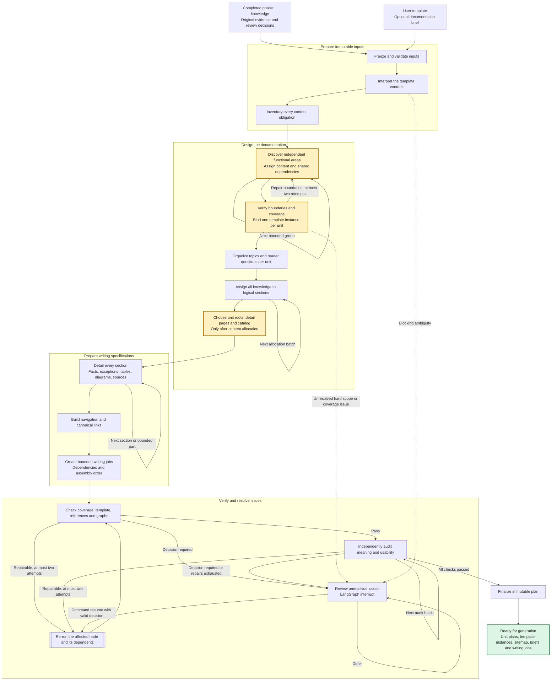

# Development Plan for Documentation Planning

Status: implementation specification for phase 2. The planning pipeline described here is not implemented yet. End-to-end capacity for two million source tokens remains unvalidated and has explicit prerequisites below.

Phase 2 turns a completed phase 1 knowledge bundle and a user template into an executable plan for a specific documentation set. Its output defines what every page and section must explain, which evidence supports it, how readers navigate it, and how a later writing stage can produce it without losing qualifications or inventing behavior.

This file is the development plan for implementing that capability. The generated `documentation-plan.md` and its structured companion artifacts are the separate, per-documentation outputs of the capability.

First determine how many independently useful functional areas the selected sources describe. Each such documentation unit receives its own instance of the template. Then establish its logical structure and assign knowledge before choosing physical pages. Discovering separate units and subdividing one unit into detail pages are different decisions. Model batch and source-file boundaries must determine neither decision.

## Scope and connection to phase 1

The existing [phase 1 plan](development-plan.md) and [implementation report](implementation-report.md) remain the baseline. Phase 1 extracts and verifies knowledge; phase 2 plans documentation; a subsequent phase writes and verifies the documentation against that plan.

```text
Legacy sources
  → Phase 1: verified knowledge, source snapshots, coverage, review decisions
  → Phase 2: template contract, functional units, logical outlines, page tree, section briefs,
             evidence allocation, navigation, writing jobs, validation report
  → Later phase: documentation prose, diagrams, rendered files, publication
```

This phase includes local CLI operation, persistent LangGraph checkpoints, bounded Gemini planning, review interrupts when needed, and a readable plan export. It does not include final document prose, a website generator, a publishing integration, a graphical editor, or automatic resolution of source conflicts.

The final status is `ready_for_generation`. It means the plan satisfies its structural and evidence checks, with any accepted unknowns explicitly assigned to documentation. It does not mean the documented system has been implemented or that future prose is already correct.

The completed ArchiveService smoke bundle is the initial real integration input. The supplied legacy run is currently interrupted by source issues and has no finalized knowledge bundle. Do not manufacture a completed legacy input or treat its unresolved claims as accepted facts to demonstrate this phase.

## Input contract

| Input | Required content and handling |
| --- | --- |
| Knowledge bundle | An immutable, supported phase 1 bundle with `status=complete`, its original signature, records, decisions, and source references. Reject drafts, unresolved blocking issues, broken references, and unsupported schema versions. |
| Source artifacts | Resolve the bundle's snapshot and original blocks, including exact excerpts, paths, heading ancestry, line ranges, and table coordinates. Source context remains available throughout planning. |
| Source selection manifest | Preserve the exact input file list and hashes inherited from phase 1. File selection defines the evidence set, not the number of functional areas. One file can describe several units, and one unit can span many files. |
| Template | Snapshot the complete UTF-8 Markdown file, initially [data/template.md](../data/template.md). Preserve its bytes, hash, instructions, heading hierarchy, and source spans. |
| Documentation brief | Optional structured file specifying audience, purpose, product name, hard scope constraints, nonbinding expected-area hints, language, unit policy, delivery mode, and organizational preferences. Resolve omitted fields through template instructions and recorded defaults. |
| Previous plan | Optional completed plan revision for stable identities and a change report. It is a planning reference, not evidence of system behavior. |

Support an existing knowledge export's `manifest.json` by resolving its `bundle_ref` through the artifact store. Also accept a validated bundle reference in the selected workspace. A manifest without the referenced objects is insufficient; explain which artifacts are missing. Cross-workspace portable import is outside the initial implementation and must fail clearly rather than guess paths.

For existing version 1 bundles without an explicit selection manifest, derive the file inventory from the immutable snapshot and label its origin `snapshot_derived`. This preserves compatibility without claiming that the original run received an explicit user file list. Never reconstruct the selection from the current directory contents.

Default documentation scope covers all eligible knowledge in the bundle. Default audience follows the template: readers who know the domain but are new to this implementation. Default language is English, unit policy is `auto`, and delivery mode within each unit is `auto`. An explicitly narrower scope creates a visible exclusion ledger; it is never inferred from a small template or an output length target. An expectation that the files contain one epic is a discovery hint unless the user explicitly restricts documentation to that epic.

Keep editorial choices in a versioned documentation brief. Keep runtime settings, secrets, and budget configuration in `.env`. Record the effective values and their origin without exposing secrets. Missing product names or review dates remain explicit unknowns; a planning run timestamp is not a human review date.

### Preserve the effective meaning of the knowledge bundle

- Use `verified` and `reviewed` claims as eligible content. Preserve `ineligible` claims in the audit trail with their decision references; do not describe them as current behavior. A `draft` claim in a supposedly complete bundle is an input integrity issue.
- Carry conditions, exceptions, timing, scope, version, modality, source status, and evidence with each claim. A requirement remains a requirement, a proposal remains a proposal, and an example cannot establish general behavior.
- Resolve entity identity through `canonical_entity_ids`, the entity register, and applicable decisions. Preserve member definitions, aliases, scope, version, and explicitly distinct entities. Matching names alone never authorize a merge.
- Interpret raw relationships together with review decisions. A stored `same_entity` or `conflict` proposal is not, by itself, a final identity or authority decision. Retain unresolved uncertainty that phase 1 explicitly acknowledged.
- Keep reviewer explanations visibly attributed as reviewer evidence. Do not relabel them as original source evidence.
- Preserve block dispositions and duplicate chains from phase 1. Documentation allocation adds a second coverage layer; it does not overwrite extraction coverage.

Phase 2 may discover a likely extraction omission by comparing knowledge with source context. Report an `upstream_knowledge_gap` and require a corrected knowledge revision when that omission prevents faithful planning. Do not silently create authoritative domain claims during planning or mutate phase 1 artifacts.

## Template contract

Compile the template into a versioned contract before planning content. Parse Markdown structure deterministically, then use a bounded model pass where instruction interpretation requires it. Validate the interpreted contract against the original spans.

The contract distinguishes fixed headings and order, required content obligations, repeatable patterns, optional sections, example content, metadata, tables, diagrams, citation requirements, and permissible extensions. Record whether the template describes a functional unit or explicitly describes an entire collection. For this workflow, the user has specified a template for one main functionality, so instantiate it once per discovered unit. Every interpretation records its source span and rationale. Plain headings alone do not imply that all user templates have the same constraints; explicit template instructions control the contract.

The current template has the following treatment:

| Template section | Required planning behavior |
| --- | --- |
| Executive Summary | Reserve two or three short paragraphs and the At a glance fields. Select representative supported claims and important boundaries. Write this overview after detailed pages in the later generation phase. |
| Core Features and Functionalities | Plan a capability map and a repeatable capability pattern. Capability A, B, and C are examples, not a fixed count or evidence that those features exist. |
| Processes or Flows | Select an evidenced primary journey, important branches, and materially different secondary flows. Plan diagram nodes and edges only when supported. |
| Data, States, and Business Rules | Account for key data, documented transitions, and rules shared across features, including exact conditions and exceptions. |
| Integrations and Dependencies | Plan boundaries, direction, exchanged information, triggers, timing, ownership, and failure behavior. Keep missing attributes unknown. |
| Roles, Access, and Operational Controls | Allocate allowed actions, scope restrictions, audit behavior, and documented operational handling. Do not infer an administrator's privileges. |
| Limitations, Exceptions, and Open Questions | Make uncertainty discoverable here while also retaining consequential qualifications next to the behavior they constrain. |
| Source References and Coverage | Provide traceability for the whole set and local evidence references for each page. Identify material placed elsewhere and justified exclusions. |

For this template, retain these eight sections and their order in each functional unit's root page by default. Omission is allowed only when genuine inapplicability is evidenced and all relevant information has another valid disposition. Absence of source information normally means unknown, not inapplicable. Record every omission or extension per template instance in the contract compliance report.

The title and metadata table remain obligations of each unit root, bound to that unit's purpose, audience, and scope. Detail subpages inherit those bindings and the knowledge revision and link to their unit root. They use the applicable capability, process, reference, or limitations pattern. Separate unit roots each use the full template; ordinary detail subpages do not. For multiple units, a collection entry page provides a concise catalog and navigation rather than pretending to be another functionality described by the template.

Template examples, bracket prompts, sample rows, and the sample Mermaid flow are instructions or illustrations, never source facts. Do not infer a notification step merely because the sample diagram contains one. Treat templates and source content as untrusted model input; they cannot override provenance, model restrictions, tool permissions, or budget policy.

When explicit brief preferences conflict with template requirements, record a contract issue with both passages. Apply already authorized, unambiguous preferences automatically; request a decision only when a substantive contradiction remains. Do not add a general approval gate for every generated outline.

## Coverage obligations and logical structure

Build a complete content inventory before proposing the outline. Each inventory item has a stable source identity, scope, content type, evidence references, and an explicit eligibility or audit disposition.

Create planning obligations for eligible claims and their qualifications, entity definitions and distinctions, accepted relationships, procedural order, table context, relevant examples, acknowledged unknowns, and attributed reviewer explanations. Use existing structured records wherever possible; source containers supply context, not permission to invent new facts.

Each nonempty claim field must survive as an obligation or an attached constraint. Preserve embedded qualifications in the statement as well as the structured fields; an independent semantic audit checks these against the original passages. Null values stay unknown and must not be completed by the model's general knowledge.

The unit-discovery stage described below uses this inventory before detailed outlines are written. Each unit's logical outline then organizes its assigned inventory around reader questions and its template instance. It contains topics and sections, not file paths. A capability, its decision rules, and its exceptional outcomes form a coherent treatment even when extracted from different files. Conversely, similarly named entities from different scopes remain distinguishable.

Allocate every obligation to a logical section before designing the page tree. Each allocation has one of these dispositions:

| Disposition | Meaning |
| --- | --- |
| `full_treatment` | The canonical section must explain the information with its required qualifications and supporting evidence. Exactly one canonical treatment per included obligation. |
| `supporting_mention` | Another section uses a scoped summary or applies the same rule in context and links to its canonical treatment. This does not satisfy canonical coverage. |
| `out_of_scope` | An explicit documentation scope excludes the item; retain a reason and the relevant brief or decision reference. |
| `audit_only` | Ineligible or superseded material remains inspectable but must not be presented as operative behavior. |
| `unassigned` | A temporary planning defect that prevents finalization. |

Qualifiers cannot be assigned exclusively to a remote limitations page while the canonical description presents an unconditional rule. Conditions and exceptions must be present in the same treatment unit, or in an explicit enclosing scope that readers cannot miss. Supporting mentions must retain the qualifications necessary to avoid misleading readers in that context.

A shared rule has one canonical explanation and contextual references from relevant features and flows. A root overview may summarize it, but that summary is not a replacement for its detailed treatment. Source coverage must distinguish full treatment from a passing mention.

If content has no natural home, first extend an allowed repeatable section, then consider a permitted appendix or reference page. Never discard a relevant fact because the template has no matching placeholder. A necessary extension forbidden by the template becomes a review issue.

## Discover functional units before planning pages

A documentation unit is a functional area with its own reader goal and supported business outcome. It may correspond to an epic in the source material, but the planner must not invent project-management epic IDs or claim that its editorial grouping is an official backlog structure. Store an explicit source epic ID only when evidence supplies one; otherwise identify the unit as an editorial organization of supported content.

The order is: complete inventory, propose units, verify boundaries and ownership, instantiate the template for each unit, plan logical sections, allocate content, and only then decide detail-page boundaries. Discovery operates over the combined selected evidence, not independently per file or model batch. Later validation can revise units, but must invalidate affected template instances, outlines, allocations, navigation, and briefs before they are reused.

### Decide between a new unit and a detail page

| Signal | How it affects the decision |
| --- | --- |
| Distinct business outcome and reader goal | Required positive evidence for an independent functional unit. A separate title alone is insufficient. |
| Independently describable journey | An evidenced trigger, meaningful actions or decisions, and an outcome support a standalone functional explanation. It need not operate without dependencies on other units. |
| Own rules, outputs, lifecycle, or actors | Supporting evidence for a coherent unit. None is individually mandatory, and actors or data can be shared. |
| Existing epic labels or domain headings | Useful candidate signals; verify their actual content and scope instead of copying the source outline mechanically. |
| More implementation details or branches of the same outcome | Normally a section or detail page within the existing unit, including most retries, failure cases, and rule variants. |
| Large volume or many prospective subpages | Triggers a boundary review and possibly navigation grouping. It does not prove that another business functionality exists. |
| Shared terms, login, customer records, or audit rules | Usually cross-cutting context. Common hub entities must not merge otherwise independent units or automatically become additional epics. |

An automatic split requires a supported distinct outcome, enough evidence for a meaningful standalone explanation, a complete assignment of affected obligations, and an independent boundary check. Record the proposed purpose, included material, boundaries, dependencies, source references, and why a child section would be insufficient. Do not enforce a fixed word count, claim count, number of units, or a fabricated numerical confidence score.

A very large cohesive functionality can still be one unit with grouped detail pages. A short but independently useful functionality can be a separate unit. Conversely, do not generate a full template instance for every small capability if that would mostly produce empty sections and repeat the parent explanation.

### Discovery and boundary verification

Use a hybrid process: deterministic inventory and reference checks, Gemini proposals for semantic organization, and a separate bounded Gemini pass for boundary verification. All calls use the configured required model and the shared budget.

1. Build descriptors for every inventory group: source identifiers, known epic labels, supported goals, actors, actions, inputs/outputs, rules, scope, and references to complete records. Treat inferred editorial labels as labels rather than new domain facts.
2. Propose candidate functional units from all group descriptors. Preserve every group's participation, including late-arriving groups and shared material. Use hierarchical bounded synthesis when the descriptor set is too large; never submit the entire corpus in a single discovery prompt.
3. Reconcile candidate units across groups using explicit dependencies, overlapping goals, lifecycle boundaries, and source identities. Source filename, batch order, and common entity names alone must not decide membership. Preserve unresolved alternatives in the boundary report.
4. Assign every obligation a proposed canonical owner: one unit, one shared reference area, or an existing justified out-of-scope/audit disposition. Record additional consuming units and exact cross-unit dependencies. Keep facts and their attached qualifiers together.
5. Independently inspect every unit and the relevant boundaries against original obligations and evidence. Check for unrelated goals forced into one template, fragments of the same journey unnecessarily split, shared rules omitted locally, accidental scope expansion, and meaningful content left unassigned.
6. Freeze supported unit identities and assignments, then bind one template instance to each unit. A binding references the immutable template contract and supplies the unit's title, purpose, audience, and evidenced scope; it does not duplicate the source corpus or create new facts.

An ambiguous editorial choice can conservatively keep a cohesive area together and record the alternative when this preserves meaning and scope. Review through `interrupt()` is necessary when the unresolved choice affects hard scope constraints, source authority, or faithful coverage. Routine supported subdivision is automatic; there is no blanket approval pause after every proposed unit.

Maintain a versioned boundary report listing each unit, evidence for its independence, ownership counts, shared dependencies, alternatives, and disposition. Unit identity and assignment are separate from physical paths, so changing a page layout does not require discovering the domain again.

### Unit policy and scope

| Policy | Behavior |
| --- | --- |
| `auto` | Discover one or more supported units inside the authorized scope and create one template instance per unit. Default for the current request. Report unexpected additional areas relative to any nonbinding expectation. |
| `single` | Retain one explicit unit. If independent unrelated functionality cannot fit its meaning or hard scope, report a scope mismatch; do not silently broaden the unit or discard that content. |
| `explicit` | Use named unit boundaries supplied in the brief, validate assignments, and report uncovered or incompatible content. |

If the user explicitly requests only epic A, discovering epic B in selected files does not authorize adding B to the documentation scope. Record B as outside the requested scope with evidence and a proposed companion unit for a later scope change. Material from B that is necessary context for A remains represented as context with its actual scope. Under the default all-selected-knowledge scope, supported A and B both receive their own template instances.

Boundary repairs may reorganize units within the authorized scope of the current revision. Changing a hard scope constraint in the input brief requires a new planning revision, preserving the previous decisions as history rather than silently applying them to changed inputs.

### Shared content and collection navigation

Use one canonical detailed treatment for shared definitions and rules, in a shared reference area when no unit is the natural owner. Link to it from every consuming unit and repeat the qualifications needed to make local explanations safe to read. Do not copy full shared explanations into every unit, and do not move a constraint away from the behavior it governs merely to avoid repetition.

The collection entry page lists functional units by reader task, explains their relationships, and links to shared reference material. It does not list every descendant page. If there are many genuine units, add navigational groupings without claiming that each grouping is another business epic. A cross-unit process can have a canonical process page linked from all participants; spanning units alone does not make it a new functionality.

Illustrative output for three independently supported areas:

```text
index.md                         Collection guide and unit catalog
policy-issuance/index.md          Full template instance
policy-issuance/validation.md     Detail page
settlements/index.md              Full template instance
settlements/reconciliation.md     Detail page
claims-handling/index.md          Full template instance
shared/roles-and-access.md        Canonical shared reference
sources/index.md                  Global evidence and coverage index
```

These names illustrate an architecture, not discovered facts about the supplied corpus. With only one unit, its template-based root can be `index.md`; no additional catalog is necessary. On later revisions, retain established unit IDs and paths where possible and record root moves or splits explicitly.

## Page structure and subpage policy

### Decision timing

Choose detail-page boundaries only after functional units, their template instances, logical outlines, and complete content allocation are available. At this point the planner can see topic size, scope boundaries, shared definitions, reader tasks, and evidence dependencies. Freeze the resulting page identities and paths before creating detailed section briefs and generation jobs.

An audit may trigger a revised page tree, but it must invalidate affected briefs, navigation, and jobs and rerun validation. The future writer cannot silently add, merge, or move pages when a prompt becomes too long; it requests a plan revision instead.

### Delivery modes

| Mode | Behavior |
| --- | --- |
| `auto` | Start with one root page per discovered unit. Introduce detail pages where content and reader tasks justify them. Add a collection catalog for multiple units. This is the default. |
| `single_page` | Keep each unit in one file with stable section anchors. Multiple units still receive separate template instances and a catalog. Partition writing jobs internally; report readability pressure without removing information. |
| `multi_page` | Use a template-based overview and coherent child pages within each unit. This enables subdivision but requires neither a minimum page count nor a page per template heading. |

Delivery mode controls page layout within a unit and never determines how many units exist. The agreed large-corpus presentation is a concise guide per functional unit following the supplied template, linked to detailed subpages and complete reference material, with a collection guide above multiple units. Each unit root remains recognizable as the template: metadata, summary, capability map, meaningful section overviews, principal boundaries, and links to detailed treatment. It must not become an empty table of links. A child page belongs to one parent in the hierarchy and may be referenced from several template sections or units. This presentation changes where information is explained, not which information is retained.

Create a subpage when a coherent topic supports a distinct reader task, needs an independently useful detailed explanation, or would otherwise make its parent difficult to navigate. Keep small, closely connected topics together. Separate incompatible versions or tenant rules explicitly, even if they share terminology; a supported comparison can place them together with clear labels.

Use these initial, configurable heuristics for recommendations, not completeness limits: a preferred detailed-page range of roughly 800–1,800 words, a split review above 2,500 estimated words, and at most three page levels within a unit including its root. A collection catalog sits above that hierarchy. Word estimates are planning estimates, not source-token counts. A justified exception is preferable to a fragmented procedure, an empty page, or lost knowledge. No hard minimum page length or fixed capability count is required. Tune the heuristics through evaluation.

Every split or merge records the reader task, content volume estimate, cohesion/dependencies, alternatives considered, and rationale. One documented rationale is sufficient; do not ask the model to produce a long essay for each page.

### Child page profiles

| Profile | Planned contents |
| --- | --- |
| Capability | Purpose, actors and inputs, main behavior, prerequisites, rules, exceptions, outcomes, related flows, evidence. |
| Process | Trigger, preconditions, ordered steps, decisions and branches, failures or recovery, completion, supported diagram specification, evidence. |
| Reference | Definitions, data, states, shared rules, roles, or integrations as appropriate; explicit scope, exact attributes, relationships, consumers, evidence. |
| Limitations | Known boundaries, uncertainty, impact, applicable decisions, and links back to affected behavior. |
| Source index | Source inventory and navigable coverage references, partitioned for large corpora without hiding records. |

These profiles are derived from the template contract and cannot silently introduce mandatory domain content. A custom template can yield different profiles.

For a small coherent ArchiveService bundle, `auto` may correctly choose only `index.md`. If the evidence later grows enough to support separate reader tasks, an illustrative layout is:

```text
index.md
capabilities/archiving.md
processes/archive-recovery.md
reference/states-and-rules.md
sources/index.md
```

This is an example of a possible layout, not a preselected output or a claim that those page boundaries are warranted by the current smoke fixture. The root still contains the template sections, and their relevant overviews link to the appropriate detail pages.

### Identity and navigation

Keep stable `unit_id`, `template_instance_id`, `topic_id`, `section_id`, and `page_id` values independent of display titles. Namespace repeated template sections by instance, so two Executive Summary sections cannot collide. On a first plan, derive identities from stable template roles and content ownership rather than model response order. On revisions, reuse prior identities through explicit mappings; record unit and page splits, merges, removals, and path changes. Do not promise identical LLM outlines across independent runs.

Assign deterministic relative Markdown paths and explicit anchors. Validate traversal, absolute paths, case-insensitive collisions, Unicode normalization, Windows reserved names, unsafe characters, and duplicate anchors. Prefer retaining established paths when a title changes. Keep a move map for later publication tooling; this phase does not implement redirects.

The hierarchy must be a rooted, acyclic tree with no orphan pages. Cross-links may form cycles. Navigation includes parent links, root access, related topics, prerequisite definitions, and canonical rule targets. Every required reader question should have a visible route from an appropriate root section.

## Detailed page and section briefs

A list of headings is insufficient. Each page brief must contain its owning unit or explicit collection/shared role, purpose, audience, scope, parent and template-instance bindings, entry questions, ordered section IDs, expected length range, dependencies, and completion checks.

Each section brief must specify:

1. The reader question and learning outcome, with its template obligation and source span.
2. Its role and form: explanation, steps, decision table, data table, comparison, diagram, warning, or reference list.
3. Exact knowledge record IDs, obligation IDs, and evidence references for full treatment and supporting mentions.
4. Required conditions, exceptions, timing, scope, versions, modality, entity distinctions, and acknowledged unknowns.
5. The explanation order, needed context, and links to canonical treatments of shared material.
6. Table columns and row identities, or diagram nodes, edges, branch labels, and their evidence, when applicable.
7. Boundaries: what belongs elsewhere, which unsupported conclusions must not be drawn, and which information is unavailable.
8. Measurable completion checks for the later writer and verifier.

Briefs contain writing instructions and evidence-backed content requirements, not polished documentation prose. Store references in compact artifacts; resolve the exact original claim and evidence into each writing job so the writer does not rely only on a lossy brief summary.

For example, the ArchiveService fixture's archiving rule requires a brief to preserve the daily 02:00 UTC timing, approval and hold conditions, the unchanged state when skipped, and its status as specified requirements rather than proof of implementation. Recovery details must preserve the original retry key and the previous revision after a failed write. A generic heading such as “Archiving and retries” does not meet acceptance without these obligations and evidence links.

Specify diagrams as a supported graph before Mermaid rendering: every state, transition, branch, actor, and sequence assertion must have evidence or be a clearly editorial grouping without a behavioral implication. Mark missing transitions unknown; never complete a lifecycle by intuition. A diagram proposal that cannot be supported must be revised or replaced with a faithful representation allowed by the template.

## Artifact contracts and output

Use strict, versioned Pydantic contracts with unknown fields rejected. Preserve domain records by reference instead of introducing a competing knowledge schema.

| Contract | Minimum fields |
| --- | --- |
| `PlanningInputs` | Knowledge, source-selection and snapshot references, template hash, brief, hard scope and expected-area hints, unit/delivery policies, previous plan reference, workflow/signature/schema versions. |
| `TemplateContract` | Source spans, application scope, metadata obligations, section hierarchy, required/optional/repeatable roles, example spans, allowed extensions, page profiles, citation rules. |
| `ContentObligation` | Source record ID and field or facet, evidence references, scope/version/modality, attached constraints, eligibility and decision references. |
| `DocumentationUnit` | Stable unit ID, title, supported purpose/outcome, audience, scope, optional source epic ID, evidence, boundaries, dependencies, discovery rationale and verification status. |
| `UnitAssignment` | Obligation ID, one owning unit/shared area or justified non-content disposition, consuming unit IDs, dependencies, boundary evidence and decision references. |
| `TemplateInstance` | Stable instance ID, unit ID, immutable template-contract reference, bound metadata, instance-specific obligation IDs, exceptions and compliance results. |
| `LogicalSection` | Stable identity, owning unit or collection/shared role, parent topic, template-instance binding where applicable, reader questions, purpose, ordering, scope, planned content form. |
| `ContentAllocation` | Obligation ID, owner assignment reference, canonical section or non-content disposition, supporting sections across units, reason and decision references. |
| `PagePlan` | Stable identity, owning unit or explicit collection/shared role, template-instance binding where applicable, path, parent, profile, title, reader task, scope, ordered section IDs, size estimate, split/merge rationale. |
| `SectionBrief` | Section and page IDs, form, full-treatment and supporting references, constraints, sequence, tables/diagrams, unknowns, cross-links, completion checks. |
| `NavigationPlan` | Root, tree edges, anchors, typed cross-links, canonical targets, optional prior-path mappings. |
| `WritingJob` | Stable job ID, owned sections or bounded section parts, context/evidence references, hard dependencies, token bounds, output contract, assembly order. |
| `PlanIssue` and `PlanDecision` | Affected inputs/records/pages/sections, exact revision, producing stage, severity, action, rationale, reviewer or automatic policy origin, status. |
| `DocumentationPlan` | References to all component artifacts, unit registry and boundary report, source and plan revisions, policies, global and per-unit audit/coverage results, decisions, final readiness status. |

Persist immutable component objects through the existing artifact store. The final export under `runs/<thread-id>/documentation-plan/<revision>/` contains:

```text
manifest.json
documentation-plan.json
documentation-plan.md
template-contract.json
content-obligations.jsonl
documentation-units.jsonl
unit-assignments.jsonl
unit-boundary-report.md
template-instances.jsonl
logical-sections.jsonl
content-allocations.jsonl
pages.jsonl
section-briefs.jsonl
evidence-index.jsonl
navigation.json
writing-jobs.jsonl
issues.jsonl
decisions.jsonl
validation-report.json
review-report.md
```

The readable `documentation-plan.md` shows the documentation purpose, input revisions, discovered units and their boundaries, template instances, sitemap, page rationale, section briefs with evidence links, known gaps, and proposed writing order. Global and per-unit coverage expose shared ownership and consuming references without counting one shared fact as several different facts. The evidence index connects allocations back to original files and locations and links to inherited phase 1 dispositions. Large indexes may be partitioned with a manifest listing every part.

The manifest identifies the exact component hashes and marks readiness only after all required checks pass. Publish the export atomically, with the final manifest last; interrupted writes cannot appear as a completed plan. Readable exports use the same validated records as machine artifacts rather than a separate model-generated summary.

## LangGraph workflow

Create a separate documentation-planning graph. Reuse shared configuration, logging, storage, model client, cache, budget ledger, and locking. Keep mutable state in graph state and immutable artifacts. Each row below is a logical LangGraph node, with a persisted checkpoint after each completed invocation.



Every named processing box corresponds to a node in the table below. `rerun` is a routing shorthand, not an additional graph node: it means returning to the actual producing node, rebuilding its dependent outputs, and validating again. Other blocking issues can enter review from their producing node too. A required upstream knowledge correction starts a new input/thread revision; the diagram's resume route applies only to decisions valid for the current inputs.

All processing remains sequential and checkpointed, including bounded loops within inventory, unit verification, and topic synthesis not expanded in the diagram. The highlighted stages separate functional-unit boundaries from detail-page boundaries; both are independent of model batch boundaries. Technical or budget failures retain a resumable checkpoint and are not routed through human content review merely because a request failed.

| Node | Responsibility and checkpointed result |
| --- | --- |
| `snapshot_planning_inputs` | Resolve and validate completed knowledge, snapshot template and brief, record effective policy and immutable input references. |
| `compile_template` | Produce and verify the template contract, recording ambiguities that cannot be settled from explicit instructions. |
| `inventory_content` | Enumerate all obligations, effective eligibility, source context, entities, relations, and inherited decisions without sampling away content. |
| `discover_documentation_units` | Propose functional boundaries from all inventory groups, assign canonical owners and consuming units, distinguish shared material, and record the evidence and alternatives. |
| `verify_documentation_units` | Independently verify goals, boundaries, authorized scope and complete assignments in bounded batches; freeze supported units and bind one template instance per unit. |
| `plan_logical_structure` | Build reader questions and a template-bound topic/section hierarchy per unit, plus required shared treatments, using bounded inventory groups and complete group indexes. |
| `allocate_content` | Refine verified unit ownership into canonical logical sections or justified non-content dispositions; persist bounded allocation batches and their cursor. |
| `design_page_tree` | Choose delivery layout within units and a catalog where needed, map sections to pages, assign stable identities and safe paths, and record subdivision rationale. |
| `write_section_briefs` | Produce detailed briefs in bounded section work items using exact allocated records and evidence; persist progress after each work item. |
| `plan_navigation` | Produce the collection and unit navigation tree, stable anchors, canonical shared links, cross-unit dependencies, and reader entry routes. |
| `plan_writing_jobs` | Partition future writing work, resolve evidence/context dependencies, and produce an acyclic execution schedule and assembly map. |
| `validate_plan` | Run deterministic integrity, coverage, template, graph, evidence, and scheduling checks against the whole plan. |
| `audit_plan` | Independently inspect semantic fidelity and usability in bounded work items, with every included obligation and brief assigned to an audit batch. |
| `review_plan` | Apply revision-bound decisions through `interrupt()` and `Command(resume=...)`, then route to the affected stage or leave unresolved issues interrupted. |
| `finalize_plan` | Recheck readiness against current artifacts, write atomic exports, and return the final plan reference. |

The normal route is the table order, except that `review_plan` is only entered when unresolved content or contract issues require a decision. Issues discovered earlier route there immediately if dependent work cannot safely proceed. An issue-free run proceeds from `audit_plan` to `finalize_plan` without a human approval pause.

Keep nodes sequential. Repeated bounded work invokes the same node with persisted queue references and cursors rather than processing the entire corpus inside one long uncheckpointed call. Store only references, progress, policy, repair counts, and issue/decision state in graph state. Do not place the complete source corpus in a checkpoint or shared singleton.

Allow at most two automatic repair attempts for a failed planning work item. Route a repair to its producing stage, invalidate its dependent artifacts, and rerun the applicable structural and semantic checks. Truncated responses are never accepted: split work while preserving ownership, context, and the later assembly contract. Repeated technical failures remain resumable technical errors, not fabricated review decisions.

Isolate `interrupt()` from paid calls and non-idempotent writes. Review actions include correcting a planning artifact, adjusting an explicitly authorized layout/scope, documenting genuine inapplicability, retaining an unknown, requesting an upstream knowledge revision, or deferring. A decision cannot waive missing references, unsupported behavioral statements, or incomplete accounting. Scope changes remain visible exclusions and cannot masquerade as recovered coverage.

An acknowledged unknown already present in the bundle normally flows into the briefs without a new interrupt. A missing optional template attribute can be planned as unknown. A new unresolved authority conflict, contradictory mandatory template instructions, or an unsupported domain assertion that repairs cannot remove requires review. Autonomous operation does not authorize invented source authority.

## Context management and writing schedule

Never put the entire knowledge bundle into a single prompt. Batch inventory, unit discovery, and mapping by stable ownership, explicit entities, rules, scope, and template roles. Use hierarchical unit/topic indexes for global organization while preserving a manifest of all child records. Discovery must include late groups and cross-group boundary checks before freezing units; it cannot finalize one unrelated epic per batch. Index summaries help organization but cannot substitute for original evidence during boundary verification, allocation, briefing, or audit.

Every inventory group must participate in outline synthesis, and every obligation must be assigned, briefed, and checked or have a valid exclusion/audit disposition. Retrieval may add context; top-k retrieval cannot define the inclusion set. Shared entities and rules generate explicit cross-group checks. Record grouping limits and unresolved contextual dependencies.

Budget input instructions, serialized schema/metadata, source context, and anticipated output separately. Reuse the existing token preflight, validated response cache, bounded retry behavior, and conservative cost reservations. Record actual batch counts, splits, token usage, and cache hits.

A reader page can require multiple model writing calls. Conversely, a small evidence context can support several section jobs without creating several pages. Each future writing job owns a precise section or section fragment; the assembly map defines order and prohibits duplicate ownership. Dependencies carry necessary definitions and claims without forcing the writer to read all previously generated prose.

Schedule detailed definitions and canonical explanations before their dependent treatments when required. Plan page overviews and each unit's Executive Summary after their detailed inputs, then assemble the collection guide when applicable; roots still appear before detail pages in the finished navigation. Keep the hard execution-dependency graph acyclic. Ordinary cross-links are not execution dependencies and may form cycles.

Every job includes acceptance requirements inherited from the section brief and a path back to exact evidence. The later writing phase must verify generated prose, tables, and diagrams against these requirements; passing phase 2 is not permission to omit that verification.

## Capacity for two million source tokens

Two million tokens is a target corpus size, not a request size or a promised maximum output size. Bounded model requests remove the need to fit the corpus into one context window. They do not by themselves bound total calls, reconciliation work, local memory, artifact growth, or semantic error accumulation. Do not describe this target as production-validated until the corresponding acceptance work has completed.

### Current evidence and bottlenecks

The existing phase 1 structural scale result contains 35,001 blocks and 340 batches from 1,155,003 whitespace-delimited words. Its recorded source-token estimate is 2,695,006, using the repository's UTF-8-byte heuristic rather than an actual tokenizer count. It measures ingestion and batch planning only. The repeated synthetic paragraph does not exercise diverse entities, global conflicts, model extraction, reconciliation, or phase 2.

| Area | Current behavior | Consequence at the target size |
| --- | --- | --- |
| Request size | Default source batches target 8,000 estimated tokens, with separate context and output budgets, preflight checks, and splitting. | Source size can exceed a model context, but model work is repeated across many bounded calls. |
| Extraction and verification | Separate model passes per accepted batch, with possible repairs and splits. | Two million tokens measured by the same heuristic imply roughly 250 nominal batches and 500 extraction/verification calls before reconciliation, retries, or planning. This is an order-of-magnitude illustration, not a token-count or cost forecast. |
| Reconciliation | `comparison_tasks` forms candidate groups, partitions them, and schedules all combinations of partitions within each group. Broad shared scope or entity keys can create large groups. | For `k` partitions, a group can require `k * (k + 1) / 2` tasks before deduplication and removal of singleton comparisons. Bounded requests do not prevent quadratic growth in calls. |
| Record access | `Pipeline.blocks()` rebuilds the full block dictionary; `Pipeline.records()` reads all verified extractions during each reconciliation invocation. | Repeated whole-corpus reads, decoding, hashing, and model validation can dominate local work even if one request is small. |
| Artifact storage | JSON objects are read and hashed in full; `write_jsonl` currently assembles the full serialized output. Growing result and batch indexes are stored as new immutable whole objects. | Peak memory and cumulative disk writes can grow substantially. Small graph checkpoints alone do not make the application streaming. |
| Global meaning | Context and reconciliation use bounded candidate policies. | Distant exceptions, differently named duplicates, or relationships outside those policies can be missed. An accounting check is not proof of semantic preservation. |

A local, model-free probe on 2026-10-08 used synthetic claims of 214 estimated serialized tokens each, a shared entity and scope, and the current 12,000-token reconciliation budget. The duplicate task sets from the two grouping keys were deduplicated by the existing implementation:

| Claim count in the synthetic fixture | Scheduled comparison tasks |
| --- | --- |
| 100 | 10 |
| 500 | 171 |
| 1,000 | 666 |
| 2,000 | 2,628 |

This measures queue construction with the actual `comparison_tasks` function, not model runtime, semantic quality, or the likely number of claims in a real two-million-token corpus. It demonstrates a concrete hotspot that a phase 2 outline alone cannot fix.

### Required scale preparation

Treat these as capacity prerequisites across the phase 1 to phase 2 boundary. Preserve the existing phase 1 knowledge meaning and compatibility rules; implement prerequisites as explicit changes with their own regression evidence.

1. **Measure the full workload before large paid stages.** Add a read-only workload report with source estimates, tokenizer counts when available, batch counts, verified record counts, largest groups, projected comparison tasks, prompt/output bounds, remaining development allowance, and disk/memory observations. Forecast reconciliation again after extraction, when actual records exist. Expose estimate uncertainty and stage totals; do not quote the price of reading the source once as the pipeline cost.
2. **Control reconciliation growth without hiding omissions.** Use indexed candidate lookup, deduplication of identical comparison tasks, reuse of validated equivalent requests, lazy task enumeration, and bounded task artifacts. Preserve every source identity and evidence reference; reuse must not merge domain entities or select source authority. These changes reduce avoidable overhead but cannot remove the worst case for genuinely dense relationships. Before replacing broad all-pairs grouping with a narrower candidate policy, specify and version its rules, retain explicit cross-group dependencies, and compare conflict/identity recall with an exhaustive reference mode on manageable fixtures. No silent top-k cap or dropped tail is allowed. A queue that exceeds a configured workload allowance remains visibly incomplete and resumable.
3. **Read relevant records by ID.** Introduce revision-bound indexes over immutable block, claim, entity, obligation, and evidence shards. A request loads its owned records and explicit context, not all prior extractions. A legacy monolithic bundle can be validated and indexed once on import; subsequent nodes use the indexed view. Indexing and bounded caches are local to a revision and cannot become mutable global run state.
4. **Stream storage and validation.** Use bounded immutable partitions and manifests for large inventories, allocation maps, task/results registries, and exports. Avoid rewriting a growing all-results dictionary at every checkpoint. Hash and write exports incrementally and perform global joins through indexes or bounded scans. Account for retained historical artifact versions when measuring disk use.
5. **Bound every hierarchy level.** Unit discovery and boundary verification, topic synthesis, page-tree planning, and unit/collection overview planning must each partition their own input and output if the list of descriptors exceeds a request budget. A final reducer cannot receive an unbounded list of every claim, unit, topic, or page. Keep complete child-ID manifests and explicit cross-group obligations so hierarchy does not become an undocumented summary bottleneck. Do not implement unit discovery as another unrestricted all-pairs comparison of all claims.
6. **Keep the human-facing plan navigable.** At large scale, `documentation-plan.md` becomes a concise unit catalog and index into `page-briefs/<page-id>.md`; full structured allocations remain available in partitioned artifacts. Each future functional unit root follows the template and leads to complete detail/reference pages. A collection guide links to units instead of listing every descendant. No fixed page count, compression ratio, or short total-word target can override coverage. Functional units, reader pages, model jobs, and storage shards remain distinct concepts.
7. **Track resource and restart behavior.** Measure peak resident memory, artifact/checkpoint sizes, bytes read/written, per-stage latency, model calls, token usage, retry counts, and repeated work after restart. Keep queues and cursors durable. Rate limits and budget exhaustion must preserve progress and report remaining work; sequential execution remains the baseline until measured latency justifies a separately designed concurrency change.

### Scale acceptance and reporting

Maintain separate readiness results for phase 2 functionality and the two-million-token capacity target. Completion of the medium-size evaluation establishes neither full-target throughput nor full-target semantic quality.

- Extend the offline workload fixtures through approximately 100k, 500k, and 2m estimated source tokens. Include diverse records, broad shared entities/scopes, large tables, long dependency chains, and exceptions located far from the main statement. Repeated paragraphs alone are insufficient.
- Exercise the complete local orchestration with a deterministic model stub and realistic record/output sizes, including reconciliation, phase 2 graph loops, export, interruption, and restart. Assert complete coverage and bounded per-request payloads while recording memory, task counts, and storage growth. Label stub results as structural evidence.
- Set explicit resource and task-count budgets against the measured test machine in M0S, before accepting the target fixture. A limit must stop or flag an incomplete workload, never remove content to make a test pass. Report scaling ratios and the largest candidate groups rather than only one total runtime.
- Use the medium-size live runs to measure response sizes, call latency, repairs, semantic retention, and cost. Compare those measurements against the full-size task projection before launching a full live run.
- A claim of end-to-end two-million-token validation additionally requires a representative full-target live run, an adequately labeled semantic evaluation, completed phase 1 and phase 2 artifacts, and no hidden unfinished comparison or audit queue. Record whether the size is heuristic-estimated or tokenizer-counted. If the existing cumulative PLN 200 development allowance is insufficient, retain the capacity status as unvalidated and report the shortfall; do not silently increase or reset the allowance.

Preserve complete detailed knowledge in the output structure. The user selected a concise template-based guide linked to full detail and reference pages as the large-corpus presentation, applied separately to independently supported functional units. This affects navigation and repetition, not the inclusion set. Exact unit/page counts and document length follow from evidence and reader tasks, not from source-token count alone.

## Repository integration and compatibility

Prefer a small, cohesive addition: planning contracts, template interpretation, unit discovery/boundary verification, planning graph/stages, and planning validation/export helpers. Extend existing storage, model, CLI, and logging only where needed. Keep phase 1 domain contracts stable. Add separate versioned planning prompts for template interpretation, unit discovery, boundary verification, logical organization, allocation, subdivision, briefs, and semantic audit.

The current phase 1 CLI accepts a source path rather than an explicit file-list manifest. Add a compatible source-selection adapter that snapshots exactly the listed files, preserves their stable relative identities, reports missing entries, and carries the selection manifest into the knowledge export. Existing single-path/directory invocation must keep working. Do not ingest linked but unselected files automatically. Phase 2 consumes the completed knowledge for that exact selection; it does not reopen arbitrary current files or perform hidden extraction to fill a unit.

Proposed invocation after implementation:

```powershell
uv run docgen plan-documentation --knowledge .docgen/runs/knowledge-001/knowledge/REVISION/manifest.json --template data/template.md --thread-id documentation-plan-001
uv run docgen status --thread-id documentation-plan-001
uv run docgen history --thread-id documentation-plan-001
uv run docgen resume --thread-id documentation-plan-001
uv run docgen resume --thread-id documentation-plan-001 --decisions planning-decisions.json
```

The first path is illustrative and must point to an existing completed export. Add optional `--brief` and `--previous-plan` inputs. The brief carries unit policy and optional named boundaries separately from per-unit delivery mode. Preserve existing phase 1 commands and exit-code meanings. Display workflow kind, current stage, input revisions, discovered units, progress, issues, and final artifacts in status output.

Register a workflow discriminator with each new thread. Resume must choose the correct graph from persisted metadata and refuse to reuse a thread for a different workflow or input revision. Persist a stable `thread_id` with SQLite and maintain one worker per run. No separate pause-file protocol is allowed.

The current implementation signature hashes all `src/docgen/*.py`, and the CLI signature enumerates phase 1 prompts. Adding this phase will therefore affect existing signature checks. Introduce explicit workflow prompt/schema manifests and documented signature scope. Never silently reinterpret an older checkpoint under changed code. Read-only inspection of old artifacts remains available; incompatible resumes need the matching implementation or a new thread revision. Reusing a finalized, validated knowledge bundle as phase 2 input does not require resuming its phase 1 graph.

A new knowledge, template, brief, prompt, code, model, or relevant configuration revision creates a new planning revision. Previous plans help preserve IDs but do not carry approvals forward automatically. Initial implementation may conservatively rebuild dependent planning artifacts; selective cross-revision reuse is optional and must not weaken signature validation. Within a revision, unchanged successful nodes resume without repeating model work.

This reuse guarantee covers checkpointed or durably cached results. A crash after a provider request but before durable response storage can leave usage and completion uncertain. Retain its conservative charge, report the ambiguity, and apply the existing bounded retry policy; do not promise exactly-once remote execution.

Use Gemini `gemini-3.8-flash` for every model call and reject other `GEMINI_MODEL` values. All development calls, including evaluation and repairs, share the existing cumulative PLN 200 ledger. The phase 1 report recorded approximately PLN 10.4132 consumed; read the live ledger before testing rather than treating that historical value as the current balance. Refresh official pricing and currency observations when required and reserve conservatively before each call. Budget exhaustion is a resumable technical stop; never reset the ledger or continue without a reservation.

## Verification and acceptance

### Deterministic gates

Finalization requires all of the following:

- All referenced input artifacts pass integrity and schema checks; every evidence reference resolves to the inherited snapshot and exact source location.
- Source selection is explicit or labeled as snapshot-derived, with no unselected current files added during planning. Every functional unit stays within the authorized scope and has a verified purpose, evidenced boundaries, and one template instance.
- Every inventoried obligation has one unit/shared owner or a justified non-content disposition. Shared consumers and cross-unit dependencies are recorded; section allocation agrees with unit ownership. No fact or exception disappears between these two allocation levels.
- Every eligible, in-scope obligation has exactly one canonical treatment. Every other inventoried item has a valid, explained disposition. No `unassigned` items remain.
- Every required qualifier is attached to its treatment; summaries are not counted as full coverage. All supporting mentions link to valid canonical targets.
- Every template obligation is fulfilled or has a permitted, justified inapplicability decision separately for each unit instance. Section/anchor identities do not collide across repeated instances. Catalog and shared-reference pages use their explicit roles instead of being falsely scored as incomplete functionality templates. Example placeholders do not become domain entities or behavioral steps.
- Every logical section is assigned to a page exactly once, and every substantive brief points to allocated content. Editorial headings and grouping text are explicitly distinguished from domain assertions.
- Paths and anchors are safe and unique; all pages are reachable from the root, every link target exists, and the hierarchy is acyclic.
- Table rows, diagram elements, scope distinctions, unknowns, and reviewer explanations retain their required identities and evidence attribution.
- Every section is owned by writing jobs with complete, nonoverlapping fragment assembly where applicable. All required context is resolvable, and hard dependencies are acyclic.
- All required audit batches completed against the current artifact revisions; no open blocking issues, stale decisions, or pending repairs remain.

Report both all-inventory disposition counts and in-scope treatment coverage, globally and per unit. Include shared-consumer obligations without inflating the global unique-fact count. A narrowed scope must not make a coverage percentage hide omitted knowledge. Retain a separate phase 1 block ledger, phase 2 unit/section obligation matrix, and per-instance template compliance matrix.

### Semantic and usability checks

The independent audit compares unit boundaries, briefs, and allocations with original records and source excerpts. It checks unrelated outcomes merged into one unit, fragmentation of one functional journey, scope expansion, omissions inside statements, changed modality, detached conditions, lost exceptions, mistaken identity, inferred order, unsupported diagrams, misleading summaries, and duplicate treatments that disagree. Use separate versioned audit prompts and evidence inputs; a planner's self-reported coverage is insufficient.

Evaluate reader tasks as well as accounting: finding an exception, tracing a state change, understanding permissions, identifying a dependency's failure behavior, and distinguishing an unresolved question from a supported rule. A plan must tell the writer enough to answer applicable questions without inventing missing details. Report findings with exact section IDs and sources.

For the labeled evaluation fixtures, require 100% expected fact and qualifier coverage, zero unsupported behavioral additions, zero incorrect scope or entity merges, and a valid entry route plus an adequate evidence-backed brief for every required reader task. Record raw counts and evaluator findings alongside percentages. These are fixture acceptance thresholds, not a claim of provable completeness on arbitrary future inputs.

Automated model judging is evidence, not proof of semantic completeness. Record evaluator limitations and manual-review status. Do not call an autonomously constructed reference set user-approved. Keep held-out planning cases separate from tuning; previously inspected phase 1 labels do not constitute a fresh blind planning evaluation.

### Evaluation fixtures

| Fixture | Required evidence |
| --- | --- |
| Completed ArchiveService bundle | End-to-end planning from an actual finalized phase 1 export; all 15 claims and applicable entity/unknown obligations accounted for; no requirement upgraded to implemented behavior. |
| Small and rich template cases | Small input stays coherent; rich input yields justified child pages. The current eight-section template is respected without treating A/B/C examples as real features. |
| Multiple epics across selected files | Three independently supported outcomes produce three template instances and a collection guide even when facts are interleaved within files. One unit spread across several files remains coherent. |
| One large cohesive functionality | Many facts, exceptions, batches, or detail pages do not alone create additional units. Page grouping keeps its navigation usable. |
| Shared dependencies and cross-unit processes | Common actors, customer data, authentication, and global rules neither collapse independent units nor become invented epics. Local constraints and canonical shared references remain complete. |
| Expected versus restricted scope | An expected single epic can discover additional units in `auto`; an explicit epic-A-only scope reports B without expanding coverage scope. Missing assignments remain visible. |
| Unit discovery at scale and across revisions | A new area appearing only in late batches is discovered; unrelated filename/order changes do not define unit boundaries; prior unit IDs and path mappings survive supported revisions. |
| Shared rules and scope variants | One canonical treatment with sufficient contextual mentions; distinct tenants/versions and explicit entity distinctions survive. |
| Unknowns and reviewed conflicts | Acknowledged gaps remain visible, ineligible alternatives stay audit-only, and raw relationship proposals do not override decisions. Incomplete phase 1 inputs are rejected. |
| Procedures, tables, and diagrams | Conditions and exceptional branches survive; header/row context is retained; unsupported sequence or transition claims fail. |
| Adversarial templates and paths | Source-like examples, contradictory requirements, injected instructions, unsafe paths, and case collisions cannot produce an accepted unsafe or unsupported plan. |
| Restart and repair | Separate-process restart after each meaningful stage, stale-decision rejection, worker locking, bounded repairs, truncation splitting, reuse of durable responses, and conservative handling of uncertain remote completion. |
| Scale beyond model context | Complete obligation accounting, bounded prompts, cross-group references, partitioned indexes, and no implicit top-k inclusion filter. Clearly distinguish structural scale results from full semantic evaluation. |

Golden expectations should assert preserved obligations, reader tasks, and template constraints rather than one exact sitemap. Several different page structures may be valid.

Run a medium-size live evaluation on a coherent, completed knowledge set that exercises several capabilities, at least two independently supported functional units, shared rules, processes, and enough content to justify detail pages within a unit. Construct and label a dedicated fixture or use a genuinely completed source set; do not bypass pending legacy reviews. Compare `auto` and `single_page` delivery with the same unit policy and knowledge, and report unit boundaries, coverage, navigability, unsupported content, page fragmentation, cost, and runtime. Avoid claiming a large-corpus quality result from a tiny smoke run.

Target approximately 30k–80k estimated source tokens, at least three capabilities, two materially different flows, and a dozen reader questions for this evaluation fixture. These describe test breadth, not mandatory properties of user documents or a required page count. Record actual serialized prompt sizes and generated knowledge volume, and fit the experiment to the remaining reserved budget without silently reducing the claimed evaluation scope.

## Implementation milestones

| Milestone | Deliverables and completion evidence |
| --- | --- |
| M0: Contracts and evaluation baseline | Freeze input adapters, output schemas, obligation semantics, template interpretation policy, representative fixtures, and reader-task expectations. Confirm existing phase 1 regression checks still pass. |
| M0S: Scale prerequisites | Profile broad reconciliation groups and whole-corpus I/O; add workload reporting, indexed record access, bounded task/result storage, and concrete resource budgets. Validate any changed candidate policy against exhaustive reference fixtures. Complete before claiming two-million-token capacity. |
| M1: Inputs and template compilation | Exact file-list selection adapter plus existing path compatibility, immutable inputs, effective decisions, generic template contract and application scope, tests for examples, optional/repeatable sections, unknowns, and unsupported inputs. |
| M2: Inventory, units, logical outlines, and allocation | Every eligible record and qualifier is inventoried; bounded unit discovery and independent boundary verification; one template instance per supported unit; complete unit/shared and section allocations; visible exclusions and gap reports. |
| M3: Page architecture | Independent unit/delivery policies, collection guide where needed, justified detail subdivision, template-compliant unit roots, shared references, stable identities, safe paths, and revision mappings. |
| M4: Briefs, navigation, and writing jobs | Section-level instructions with tables/diagrams and exact evidence, valid links, bounded future writing inputs, complete assembly, and acyclic hard dependencies. |
| M5: Verification, review, and persistence | Deterministic gates, independent semantic audit, bounded repair routing, revision-bound interrupts/resume, restart checks, shared budget enforcement, and atomic exports. |
| M6: Live validation and handoff | Completed smoke and medium-size planning runs within the remaining budget; recorded structural and semantic results, readable exports, documented CLI, and a phase 2 implementation report. |
| M7: Two-million-token capacity validation | Full local orchestration and resource measurements on diverse target-size fixtures; then a full-target live run and semantic evaluation if the shared budget permits. Report this readiness separately from M6 and leave it unvalidated if required evidence is missing. |

Implement incrementally in this order. Use deterministic tests for invariants and fixture-driven semantic evaluations for judgment-dependent behavior. During implementation, run appropriate existing regressions alongside the new stage checks. The user has authorized autonomous development testing; routine passing stages require no additional confirmation.

## Definition of done

Phase 2 is complete when the CLI can take a valid completed knowledge bundle and the supplied template, resume after a process restart, discover and verify one or more functional units, bind the template independently to each, and emit a validated documentation plan with justified page boundaries, detailed evidence-backed section briefs, complete disposition accounting, shared references, working collection/unit navigation, and executable writing jobs. The real smoke and medium-size evaluation must finish, or any remaining acceptance limitation must be reported explicitly rather than marked complete.

The additional statement that the complete pipeline is validated for two million source tokens requires M0S and M7 evidence. Until then, describe it as designed for bounded processing of large corpora with measured capacity limitations, not as guaranteed to finish that workload within the development budget or a fixed duration.

The deliverable for the next phase is an immutable plan revision plus its exact knowledge and template inputs. The writer receives a resolved structure and explicit content requirements; it does not have to rediscover the documentation architecture or decide which source information to omit.
