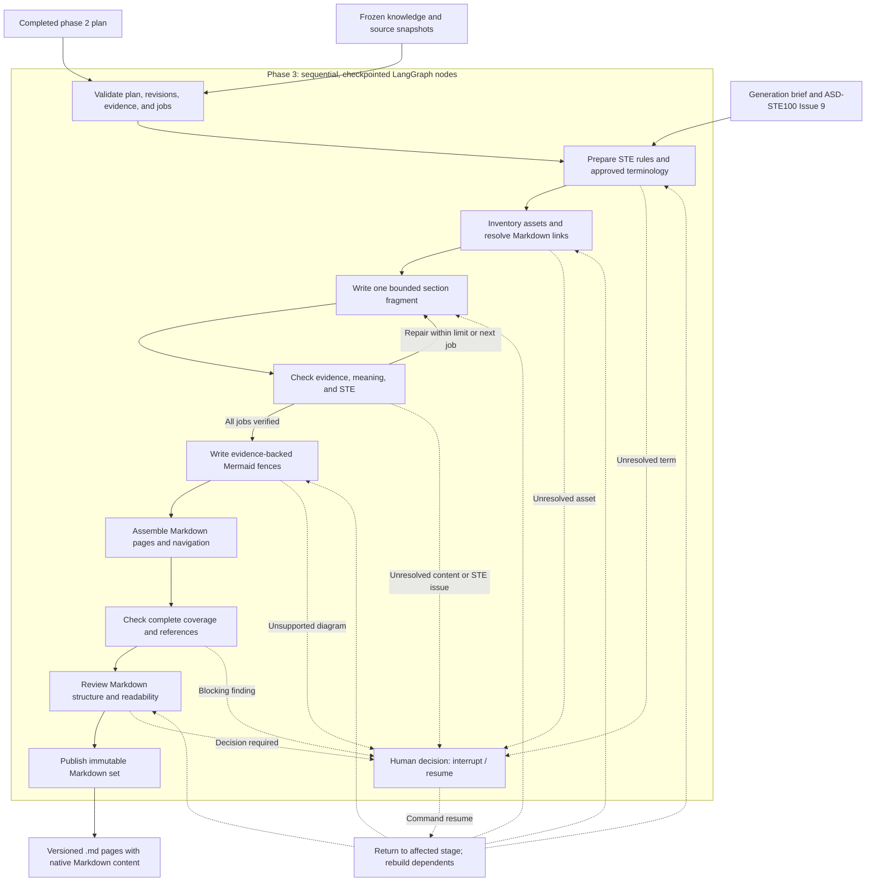

# Development Plan for Documentation Generation

Status: draft for review. This document specifies phase 3; it does not report an implementation or acceptance result. It assumes a completed phase 2 plan and does not change the phase 2 workflow.

## Objective and boundary

Turn a `ready_for_generation` documentation plan into finished, readable, evidence-backed Markdown documentation. The result must explain the system accurately, follow the planned page structure, use ASD-STE100 Simplified Technical English for authored English text, and include supported diagrams and links to requested source assets. Use Markdown structure for readable navigation and source references.

Phase 1 establishes source-backed knowledge. Phase 2 allocates that knowledge to functional units, pages, sections, and bounded writing jobs. Phase 3 writes, checks, and assembles Markdown pages. A plan coverage result is an input check, not evidence that the generated prose is complete or correct.

The documentation deliverable consists only of versioned `.md` files. Use Markdown headings, lists, tables, blockquotes, links, image references, code fences, and Mermaid fences where supported by evidence. Do not generate HTML, CSS, JavaScript, PDF, SVG, PNG, or other presentation files. Existing source attachments may be referenced by Markdown links without copying or transforming them. External hosting, editing original sources, and automatic resolution of source conflicts are outside this phase.

## Inputs and handoff

| Input | Required handling |
| --- | --- |
| Phase 2 plan | Resolve its manifest and immutable component references. Require `ready_for_generation`, supported schema and workflow signatures, intact hashes, passing current validation, and no unresolved blocking issue. |
| Phase 1 knowledge and snapshots | Follow the plan's exact knowledge revision to eligible claims, original blocks, excerpts, decisions, selection manifest, and inventoried assets. Reject missing or inconsistent references. |
| Template and documentation brief | Use the frozen template contract, effective audience, language, scope, delivery policy, and authorizations recorded by phase 2. Do not reinterpret template examples as source facts. |
| Writing jobs | Use `writing-jobs.jsonl`, resolved context references, completion checks, dependencies, and assembly order. A job is a bounded model task, not necessarily a whole page. |
| Diagram specifications | Use the section briefs' supported nodes, edges, labels, unknown transitions, and obligation references. |
| Generation brief | Add only phase 3 editorial choices: Markdown organization, source-asset link requests, source-quote policy, and approved technical terminology. A new scope or page structure requires a new phase 2 plan revision. |
| ASD-STE100 reference | Pin the official issue used for writing and review. The initial target is Issue 9, dated 2025-01-15. Record the issue identifier and reference hash; do not redistribute the standard or its dictionary in generated artifacts. |

Keep input revisions and the effective generation brief in the output manifest. Never rebuild a selection from the current source directory. A completed phase 2 plan can contain unknowns; these remain visible in the finished documentation and cannot be filled from general model knowledge.

## Writing contract

### Meaning and coverage

- Every in-scope obligation must have one canonical treatment at its allocated section. Supporting mentions must link to it and retain any qualification needed to avoid a misleading summary.
- Preserve conditions, exceptions, timing, thresholds, scope, version, modality, entity distinctions, reviewer attribution, and documented uncertainty. State whether a source describes a requirement, proposal, example, or observed behavior.
- Ground substantive statements, table cells, diagram behavior, and examples in exact eligible evidence. An editorial transition may improve readability but must not add system behavior.
- Write details before dependent overviews. Write unit executive summaries after the underlying pages, and the collection guide after unit summaries.
- Resolve repetition through canonical explanations and links. Do not shorten a page by dropping a unique fact, rule, exception, or source reference.
- Keep original excerpts verbatim and visibly identified as quotations. Do not silently rewrite quoted source material into STE and present it as an exact excerpt.

### ASD-STE100 language policy

ASD-STE100 applies to all newly authored English prose, procedural steps, warnings, table text, navigation labels, captions, and diagram labels. Use the official writing rules and controlled dictionary together. Track approved technical nouns and verbs for this system in a versioned terminology register with source or reviewer authority, definition, permitted form, and scope. Names, IDs, code, exact source quotations, and citation metadata remain recognizable; their treatment in a checker must be explicit rather than hidden as a blanket exemption.

Prefer direct, unambiguous sentences and a logical explanation order. Make the text useful to domain readers who are new to this implementation. The earlier request for natural, reader-friendly writing is satisfied through clear organization and concrete explanations within STE, not through varied synonyms or decorative language.

Automated checks should identify dictionary, part-of-speech, terminology, and mechanically testable writing-rule findings. A separate model pass may suggest repairs, but it must compare the revised text with the original obligations and evidence because a language rewrite can change meaning. Findings that require interpretation go to a qualified human reviewer. Do not claim that a checker or model certifies full ASD-STE100 compliance. Record the reviewed scope, open findings, and reviewer identity in the release report.

The official STEMG describes STE as writing rules plus a controlled dictionary and permits subject-specific technical nouns and verbs. It also says tools cannot replace the standard. References: [official FAQ](https://www.asd-ste100.org/STE_faq.html), [Issue 9 downloads](https://www.asd-ste100.org/STE_downloads.html), and [tools guidance](https://asd-ste100.org/STEsoftware.html).

## Diagrams, tables, and attachments

Write diagrams as fenced `mermaid` blocks inside the relevant `.md` page, using the evidence-backed graph in the section brief. Check each node, edge, condition, actor, and label against its obligation and original evidence. An unknown transition stays unknown; do not complete a process or state machine for visual symmetry. If the plan proposes a diagram whose behavior cannot be supported, repair the specification through a new plan revision or use a faithful text or table explanation allowed by the template. Keep the explanation readable even in a Markdown viewer that shows Mermaid source instead of a drawn diagram. Do not generate a separate diagram file or HTML diagram.

Generate tables from specified columns and row identities. Verify each factual cell, including empty or unknown values, against its assigned evidence. Keep important qualifications next to the row they constrain.

Inventory attachments and referenced images from the frozen source snapshot and explicit brief requests. Record each asset's path, hash, source location, purpose, inclusion decision, and link target. Use Markdown links or image references to existing immutable source assets when authorized; do not copy, modify, or generate binary attachments as part of the documentation deliverable. Link an image's human-provided explanation as attributed reviewer evidence. Do not use a vision model to infer what an image shows. If an expected attachment is missing, unsupported, or has unclear purpose, report the gap and request a decision through the workflow. The absence of an asset instruction is not permission to fabricate an attachment.

The Markdown documentation should include an evidence/source index and an attachment index when assets are referenced. All local links must resolve from their `.md` files to the planned page, source snapshot, or existing attachment. The release report must state when an external or workspace-relative attachment link makes the documentation dependent on that source location.

## Markdown presentation

Use a consistent Markdown structure: one page title, ordered heading levels, concise paragraphs, useful lists, readable tables, blockquotes for clearly labeled notes or warnings, descriptive links, and code fences only when they aid understanding. Distinguish requirements, known behavior, examples, and open questions with explicit text labels and headings. Preserve the planned page tree. Use Markdown heading links when their slugs are stable in the chosen Markdown convention; otherwise link to the page. Do not emit raw HTML, inline styles, or HTML anchors inside `.md` files.

Keep presentation within Markdown syntax. Validate heading order, table structure, Mermaid fence syntax, link targets, image alternative text, navigation, and source references. Review representative `.md` pages for readability: a dense rules table, a Mermaid flow, a page with unknowns, and a long detail page. A Markdown viewer may display these files, but phase 3 does not produce or test a separate rendered publication.

## Sequential LangGraph workflow

Each named stage is a LangGraph node. Use the existing shared configuration, logging, model client, cost ledger, artifact store, cache, run lock, and SQLite checkpointer. Use a stable `thread_id` and synchronous durability. Keep large text and assets in immutable artifacts; graph state contains references, queue cursors, revisions, and decisions. Execute writing jobs sequentially at first, with a checkpoint after each bounded job or verification step.



The `affected` box shows routing after a valid review decision, not an additional LangGraph node. A technical failure or budget stop retains its checkpoint and does not enter human content review. The diagram shows the normal path; bounded writing and verification repeat until every job is complete.

| Node | Checkpointed result |
| --- | --- |
| `validate_generation_inputs` | Validated plan, knowledge, template, brief, job DAG, hashes, and frozen generation signature. |
| `prepare_language_contract` | ASD-STE100 issue, authorized technical terminology, quote handling, and check configuration. Missing authority for a necessary technical term is a review issue. |
| `prepare_assets` | Complete asset inventory and explicit link, explain, or exclude disposition for every relevant referenced asset; no asset file is generated or copied. |
| `draft_writing_job` | One immutable section fragment with obligation-level source annotations and a bounded model response. Resume from the next job after restart. |
| `verify_writing_job` | Structural and evidence checks, independent semantic verification, STE findings, and up to two bounded repairs of the affected fragment. |
| `write_mermaid_diagrams` | Mermaid code fences placed in planned Markdown sections, with evidence mapping and validated labels. |
| `assemble_pages` | Markdown pages assembled from nonoverlapping fragments in the plan's order; navigation, canonical links, citations, and indices. |
| `validate_documentation` | Global obligation coverage, cross-page consistency, template compliance, citation integrity, Mermaid and table fidelity, link checks, and full-page STE findings. |
| `review_markdown_presentation` | Check heading hierarchy, navigation, table readability, notes, Mermaid fences, and representative `.md` pages. |
| `finalize_documentation` | Recheck current revisions and publish only the completed `.md` documentation pages atomically. |

`review_generation` is an additional node entered only for unresolved content, language, source-asset, or Markdown structure decisions. Use LangGraph `interrupt()` and `Command(resume=...)` with issue IDs and artifact revisions. A decision may correct a draft, approve a justified technical term, provide an asset explanation, retain a genuine unknown, or request an upstream revision. It cannot waive unsupported facts, broken provenance, missing mandatory coverage, or a required template section without evidence. Keep the interrupted stage and all completed jobs inspectable. Budget and technical failures remain resumable failures, not content decisions.

Use only Gemini `gemini-3.8-flash` for model calls. Reuse the existing conservative PLN 200 cumulative development ledger and current verified pricing. Estimate and reserve the cost of each live request before dispatch; stop before the allowance would be exceeded. Cache only validated immutable responses keyed by source, plan, prompt, schema, model, style contract, glossary, and relevant configuration versions. Do not allow a cache hit to bypass changed evidence or STE rules.

## Artifacts and release status

Publish the reader-facing documentation under `.docgen/runs/<thread-id>/documentation/<revision>/`. Every generated file in this directory has a `.md` extension. Its paths follow the validated phase 2 page tree, for example:

```text
documentation/<revision>/
  index.md
  <planned-unit-or-detail-path>.md
  sources/index.md
  attachments/index.md
```

`attachments/index.md` exists only when the plan calls for attachment references. Mermaid diagrams stay in the relevant page's fenced code block. Do not put HTML, CSS, rendered diagrams, copied images, or other asset files in the documentation directory.

Keep workflow-only data in the existing artifact store and a separate `.docgen/runs/<thread-id>/generation-metadata/<revision>/` directory: the manifest, generation brief, language contract, terminology register, asset-link decisions, writing and verification results, coverage, STE review, diagram evidence, and link reports. These machine-readable files are internal run records, not generated documentation. The manifest records source, knowledge, plan, template, language, terminology, code, and output revisions; component hashes; completed checks; open issues; reviewer decisions; and `status=ready_for_review` or `status=complete`. Only `complete` is a finished documentation set. Publish documentation and metadata atomically, with the final manifest last. Keep prior revisions available and never overwrite a published set in place.

## Evaluation and acceptance

Start with the finalized ArchiveService plan as a small vertical slice. Use it to test the full route from writing jobs to completed `.md` pages, source links, a supported Mermaid block, terminology review, restart, and an interrupted correction. Then evaluate a medium multi-unit plan with shared rules, dense tables, alternative flows, unknowns, and source-asset links. Do not claim large-corpus readiness from the small slice.

Deterministic tests must cover missing or corrupted inputs, stale plan revisions, duplicate fragment ownership, all-obligation accounting, table and diagram references, broken links, absent assets, unsafe paths, restart after each significant node, and revision-bound review decisions. Semantic evaluation compares generated passages with annotated facts, qualifications, modality, and evidence. Run the acceptance sample without reusing cached model responses; retain checkpoints and immutable artifacts so restart behavior remains testable. Record the cache mode and actual request costs. Include a human review of content accuracy, reader usefulness, and ASD-STE100 application. A model audit alone is not acceptance evidence.

Acceptance for a completed documentation set requires:

1. Every included phase 2 obligation is covered canonically in the planned section, with correct local qualifications and evidence; exclusions and audit-only material remain visible in the ledger.
2. No unsupported behavioral statement, invented diagram transition, incorrect entity merge, or silent change from requirement to implemented behavior.
3. All required template sections, page routes, citations, Mermaid diagrams, tables, and links to requested existing attachments are present or have a justified, reviewable disposition.
4. Authored English text has no unresolved blocking ASD-STE100 finding under the pinned issue and terminology register. The report states the scope and human review result without claiming external certification.
5. The reader-facing output contains only `.md` files. Its headings, lists, tables, Mermaid fences, page navigation, citations, and links use valid Markdown; no local page or authorized source-asset link is broken.
6. A restart or review interrupt resumes from persisted progress without losing or silently replacing completed work. Costs remain within the shared development allowance.

Report semantic quality, STE findings, Markdown structure defects, cost, and runtime separately. A coverage percentage describes accounting against the accepted knowledge bundle, not perfect recall of an arbitrary original corpus. Two-million-token end-to-end readiness requires its own representative phase 1 through phase 3 evaluation and remains unvalidated until measured.

## Delivery milestones

| Milestone | Evidence of completion |
| --- | --- |
| M0 — Handoff and terminology | Validated phase 2 import; pinned official ASD-STE100 issue; versioned technical terms and generation brief. |
| M1 — Bounded writing | Resumable job drafting, assembly ownership, evidence annotations, and fragment-level semantic checks on ArchiveService. |
| M2 — Language and references | STE review workflow, supported Mermaid fences, table checks, and source-asset link decisions. |
| M3 — Markdown delivery | Versioned `.md` pages with navigation, citations, link checks, and editorial review of Markdown structure. |
| M4 — Quality evaluation | Small and medium live results, human review, measured cost, restart behavior, limitations, and final acceptance report. |

## Decisions to confirm during review

- Who will approve the system's technical nouns and verbs and perform the final STE review?
- Which existing source images or attachments should be referenced by Markdown links when the inputs do not state an explicit disposition?
- Should the output include only the English ASD-STE100 edition, or a separately reviewed Polish translation as an additional deliverable?

These decisions affect the generation brief and acceptance evidence. They do not authorize phase 3 to invent missing domain facts or to rewrite an unfinished phase 2 plan.
