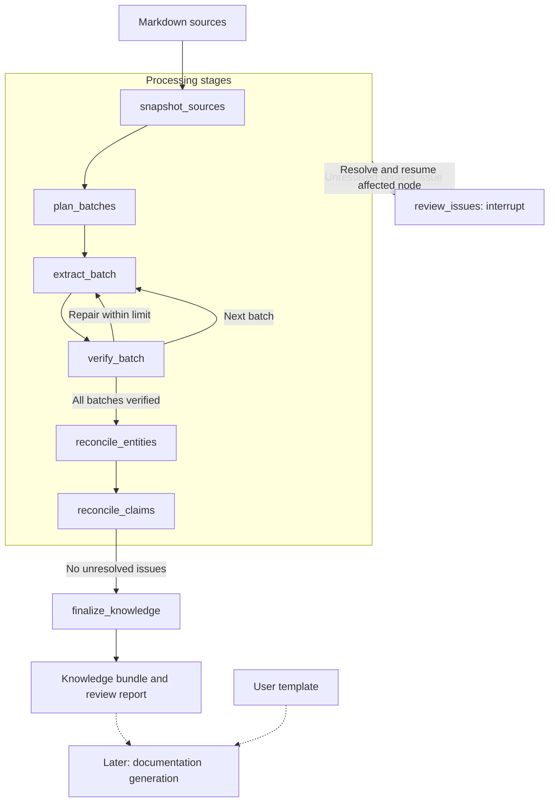

# Development Plan

Status: architecture, operating policies, evaluation ownership, budget, and acceptance criteria confirmed. The reference set still requires preparation and user review.

## Objective and scope

Convert legacy Markdown into versioned, traceable knowledge for later documentation generation from a user template. Preserve information, conditions, exceptions, and source locations across corpora exceeding one million tokens.

This phase ends with a knowledge bundle and review report. Template mapping, prose generation, publishing, and an optional Streamlit interface belong to later phases. The target reader understands insurance but needs the specifics of this system.

## Workflow

Each named operation is a LangGraph node. Run locally for one operator and process batches sequentially initially. Any unresolved content issue pauses its producing stage through `review_issues`; completion requires resolution. Resume the affected node after the decision.

| Node | Required behavior and output |
| --- | --- |
| `snapshot_sources` | Create immutable source snapshots. Parse headings, paragraphs, lists, tables, and links into identifiable blocks with source locations. Inventory unreadable files and unsupported assets. |
| `plan_batches` | Assign every block to one extraction batch. Add bounded context from headings, table headers, adjacent blocks, definitions, and explicit links. Record dependencies and token budgets. |
| `extract_batch` | Extract structured information with evidence references and proposed coverage dispositions. Preserve source wording and requirement/implementation status. Do not filter extraction by the output template. |
| `verify_batch` | Validate schemas, references, and excerpts in code. Use a separate model call to detect omitted details, distorted meaning, and unsupported additions. Allow at most two repair attempts; unresolved content issues pause the stage for review. |
| `reconcile_entities` | Build shared registers of terms, actors, services, and relationships. Preserve aliases and scope; record ambiguous merges for review. |
| `reconcile_claims` | Compare bounded groups by entity, rule, scope, and version. Identify duplicates, variants, conflicts, and missing dependencies. Preserve evidence from every source; a human must resolve conflicting authority. |
| `review_issues` | Present issues with a readable source report and collect CLI decisions through `interrupt()`. Record decisions against artifact revisions. Route corrections through affected stages; deferral keeps the stage paused. |
| `finalize_knowledge` | Validate coverage and decision consistency; require zero unresolved issues. Freeze a knowledge revision with eligible claims, resolved-issue history, and provenance. |

## Data and coverage

- **Source block:** snapshot, relative path, heading path, line range, exact content, and table coordinates where applicable.
- **Batch:** owned block IDs, context block IDs, dependencies, budgets, status, and attempts. Reused context keeps its original IDs.
- **Claim:** statement, entities, conditions, exceptions, frequency/time, scope, modality, evidence references, and review status. Unknown values remain unknown; one claim may require multiple source passages.
- **Entity:** canonical name, aliases, type, definition, scope/version, evidence, and review status.
- **Coverage/issue/decision records:** source or claim IDs, disposition, explanation, artifact revision, and any reviewer action.

Every block must be represented, linked as a duplicate, explicitly excluded with justification, or marked unresolved. Unresolved is a draft status that blocks completion. Keep original tables, procedures, and examples available alongside extracted records. Complete block accounting does not establish complete semantic preservation.

Inventory referenced images and diagrams and present them for human explanation; do not interpret images with the model. Record explanations as attributed reviewer evidence linked to the original asset. Ordinary approval must not turn an unsupported claim into a source-backed fact.

## Context and execution

- Process all sources through context-preserving partitions. Do not use RAG or top-k retrieval as the coverage mechanism.
- Budget instructions, source material, supporting context, and output separately. Split oversized batches and retry truncated output with smaller batches. Never accept truncation as a complete result.
- Keep the global register outside prompts. Supply relevant entries with their versions and evidence. Record missing context and unperformed comparisons; partition reconciliation groups without discarding original claims.
- Use Python, LangGraph, Gemini `gemini-3.8-flash`, and Pydantic contracts. Follow [AGENTS.md](../AGENTS.md). Store prompts in versioned files and runtime configuration in `.env`.
- Use files/JSONL for artifacts and SQLite for persistent checkpoints. Keep one active worker per run; shared deployment is outside this release.
- Persist checkpoints with a stable `thread_id`. Keep artifact references, progress, and decisions in graph state. Save large artifacts separately and atomically before returning their references.
- Key reusable results by input, context, prompt, schema, model, and configuration versions. Invalidate dependent results and approvals when these change. Make repeated artifact writes safe; isolate human interrupts from costly calls.
- Record stage inputs/outputs, attempts, errors, timing, and token usage. Distinguish technical failure from unresolved source knowledge. Never include secrets in logs.
- Gemini API testing is authorized within a cumulative PLN 200 development budget, including experiments, retries, and repairs. Persist spending across runs; do not reset the allowance on restart. Before live calls, verify pricing and currency conversion, reserve a conservative request cost with billing headroom, and pause before the remaining allowance would be exceeded.

## Delivery milestones

| Milestone | Completion evidence |
| --- | --- |
| M0 — Evaluation set | Codex selects approximately 40 passages from the existing synthetic corpus and annotates expected facts, qualifications, source references, and entity distinctions. The user reviews the reference set before evaluation. Reserve a held-out subset. |
| M1 — Ingestion and batching | Every input is inventoried; all parsed blocks have stable snapshot locations and assigned batches. Oversized inputs remain bounded and visible. |
| M2 — Extraction and verification | One batch, then the complete queue, produces validated records, coverage, bounded repairs, and resumable progress. |
| M3 — Reconciliation and review | Shared registers, traceable conflicts, persisted human decisions, and revision-aware corrections produce a knowledge bundle. |
| M4 — Corpus evaluation | Run a corpus exceeding the model context window; exercise restart and interrupt/resume. Compare quality, cost, and runtime against agreed acceptance targets. |

Evaluate owned-source batch sizes of 8k, 16k, and 32k tokens and the effect of the verification pass. Measure retained information, unsupported additions, lost qualifications, entity/conflict accuracy, token usage, and review effort.

Acceptance on the user-approved reference set requires 100% of annotated information, conditions, and exceptions preserved; correct evidence references; zero unsupported additions; and zero incorrect entity merges. Every source block must have a disposition. Passing this sample does not establish complete semantic preservation across the entire corpus; report corpus-level findings separately. All test variants share the PLN 200 allowance.

## User decisions

| Decision | Choice or next action | Status |
| --- | --- | --- |
| Execution environment | Local, single operator; files/JSONL for artifacts and SQLite for persistent checkpoints. | Confirmed |
| Unresolved issues | Pause the producing stage until all its issues are resolved. Persist drafts; do not finalize incomplete knowledge. | Confirmed |
| Conflicting source authority | Present conflicting evidence and obtain a human decision; no automatic choice of an authoritative version. | Confirmed |
| Review interface | CLI and a readable report showing source evidence. | Confirmed |
| Referenced images | Inventory and present for human explanation; no model-based image interpretation. | Confirmed |
| Evaluation ownership | Codex prepares approximately 40 annotated passages from existing synthetic data; the user reviews the expected results before evaluation. | Confirmed |
| Development test budget | Autonomous Gemini API testing within PLN 200 total across all development test runs, including retries and repairs. | Confirmed |
| Reference-set acceptance | Preserve all annotated information and qualifications, with correct references, zero unsupported additions, and zero incorrect entity merges. | Confirmed |

Background, examples, and technical references: [Notes.md](Notes.md).
