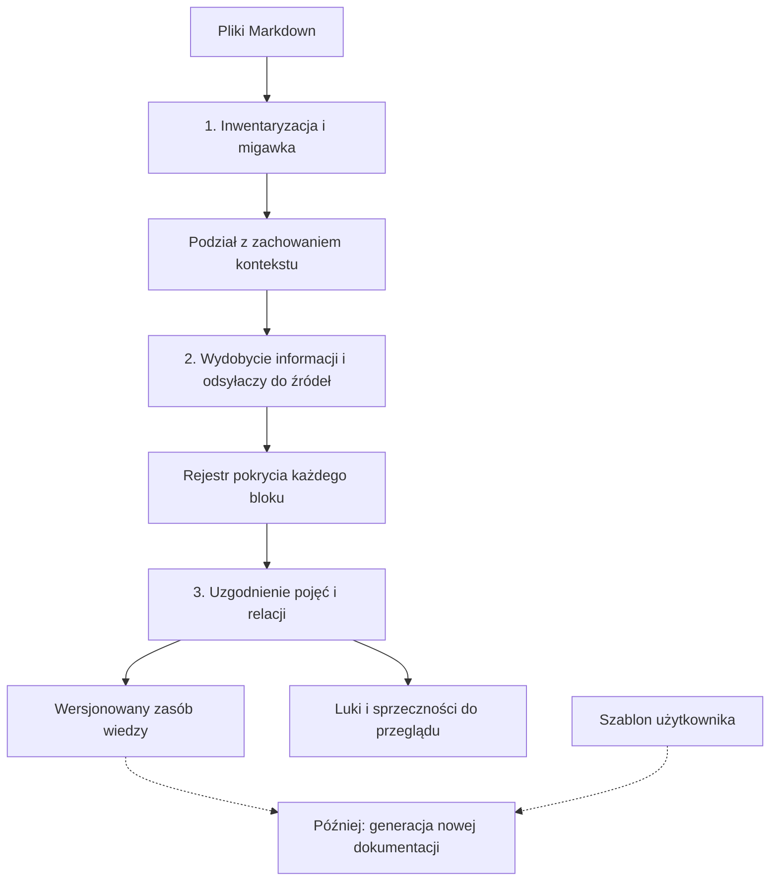

# Development Plan

## Cel

Przekształcić duży zbiór starej dokumentacji Markdown w nową dokumentację według szablonu użytkownika, bez utraty istotnych informacji i z możliwością prześledzenia każdej tezy do źródła.

## Zakres obecnej iteracji

1. **Źródła:** zinwentaryzować pliki, zapisać ich wersjonowaną migawkę i podzielić je według struktury Markdown. Każda partia zachowuje kontekst potrzebny do interpretacji. Cały korpus może przekraczać milion tokenów; żadne wywołanie modelu nie wymaga pełnego korpusu. RAG nie jest podstawą procesu.
2. **Wydobycie:** zapisać małe, sprawdzalne informacje z warunkami, wyjątkami, częstotliwością, zakresem i dokładną lokalizacją w źródle. Każdy blok wejścia otrzymuje status w rejestrze pokrycia. Niepewne lub niewydobyte informacje pozostają widoczne.
3. **Uzgodnienie:** utworzyć wspólny słownik pojęć oraz rejestry aktorów, usług i relacji. Oznaczyć duplikaty, luki i sprzeczności, zachowując ich źródła. Nie rozstrzygać niepewności bez podstawy.

## Wynik tej iteracji

Wersjonowany zasób wiedzy, rejestr pokrycia oraz lista kwestii do przeglądu. Każdy rekord informacji musi prowadzić do konkretnego pliku i miejsca w migawce źródła. Poprawność wydobycia sprawdzamy na reprezentatywnej próbce większej niż jedno okno kontekstowe.

Ustalenia redakcyjne i szczegóły z rozmów są w [Notes.md](Notes.md). Zasady implementacji dla Codex są w [AGENTS.md](../AGENTS.md).
