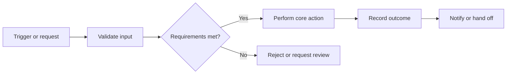

# [System or Product Name]

> **Document purpose:** Describe how the system works for readers familiar with the business domain but new to this implementation. Replace every bracketed prompt with supported content. Include source references for substantive claims and retain conditions, exceptions, and uncertainty. Omit a section only when it is genuinely inapplicable; record relevant source information elsewhere before doing so.

| Document detail | Value |
| --- | --- |
| Scope | [Product, subsystem, tenant, region, or version covered] |
| Audience | [Primary readers and decisions this page supports] |
| Knowledge revision | [Revision or snapshot identifier] |
| Last reviewed | [Date and reviewer, if known] |
| Source set | [Links to the source inventory or source documents] |

## Executive Summary

[In two or three short paragraphs, explain what the system does, who uses it, and the business outcome it supports. Name the major capabilities and the most important boundaries. Distinguish documented behavior from proposed or uncertain behavior. Cite the underlying sources.]

> **At a glance**
>
> - **Primary users:** [Roles and their goals]
> - **Main inputs:** [Events, files, requests, or records]
> - **Main outputs:** [Records, decisions, documents, or notifications]
> - **Key constraint:** [The most consequential rule or dependency, with source reference]
> - **Open question:** [Unresolved point, or “None recorded”]

## Core Features and Functionalities

[Open with a short map of the capability groups. Add, remove, or reorder subsections to match the product rather than forcing every feature into the examples below.]

| Capability | What it enables | Primary actor | Evidence |
| --- | --- | --- | --- |
| [Capability A] | [One-sentence outcome] | [Role or service] | [Source reference] |
| [Capability B] | [One-sentence outcome] | [Role or service] | [Source reference] |
| [Capability C] | [One-sentence outcome] | [Role or service] | [Source reference] |

### [Capability A: e.g., Record Creation]

**Purpose.** [Explain the business need and the resulting record or state.]

**How it works**

1. [Actor or system initiates the action and supplies required input.]
2. [Validation or decision occurs; include conditions and thresholds.]
3. [System records the result and communicates it to downstream users or services.]

**Rules and variations**

- **Prerequisites:** [Required role, configuration, data, or prior state.]
- **Exceptions:** [Rejection, retry, manual review, or alternate path.]
- **Outcome:** [Created record, status transition, and visible confirmation.]
- **Source references:** [Block IDs, file links, or line references supporting the above.]

### [Capability B: e.g., Review and Approval]

[Describe the review decision in a compact table when roles, outcomes, and conditions matter more than a step-by-step narrative.]

| Decision point | Condition | Result | Source |
| --- | --- | --- | --- |
| [Standard path] | [Condition] | [Resulting state or action] | [Reference] |
| [Exception path] | [Condition] | [Escalation or rejection] | [Reference] |

> **Important distinction:** [Clarify a commonly confused term, status, or scope. If the sources disagree, describe the disagreement and link to the review decision.]

### [Capability C: e.g., Reporting and Notifications]

[Use a short paragraph to connect this feature to the earlier capabilities. Then list each output with its trigger, recipient, timing, and suppression or retry rules.]

- **[Output 1]:** [Trigger] → [Recipient or destination] → [Timing and content]. [Source]
- **[Output 2]:** [Trigger] → [Recipient or destination] → [Timing and content]. [Source]

## Processes or Flows

[Choose a diagram for the main journey and a table for important branches. Replace the sample labels with real steps; keep the diagram consistent with the written rules.]

### Primary flow: [Flow name]

1. **Trigger:** [Who starts the flow, when, and with what input.]
2. **Validation:** [Checks, rules, and data dependencies.]
3. **Decision:** [Possible outcomes and the conditions for each.]
4. **Completion:** [Persisted state, user-visible result, and downstream effects.]

| Variation | Entry condition | Changed steps | Final state | Evidence |
| --- | --- | --- | --- | --- |
| [Manual review] | [Condition] | [Who reviews and what they decide] | [State] | [Reference] |
| [Correction or retry] | [Condition] | [What repeats or is amended] | [State] | [Reference] |

### Secondary flow: [Optional flow name]

[Describe a materially different path here, such as amendment, cancellation, reversal, or recovery. If only one flow exists, remove this subsection after confirming the source inventory does not contain another path.]

## Data, States, and Business Rules

### Key data

| Data item | Meaning and owner | Created or updated by | Used by | Source |
| --- | --- | --- | --- | --- |
| [Item] | [Definition and system of record] | [Feature or integration] | [Decision or output] | [Reference] |

### State lifecycle

`[Initial state]` → `[Intermediate state]` → `[Completed state]`

[Explain who can cause each transition, what must be true beforehand, and whether a transition can be reversed. Include terminal and exceptional states where documented.]

### Rules that affect multiple features

| Rule | Applies to | Conditions and exceptions | Source |
| --- | --- | --- | --- |
| [Rule or calculation] | [Features or flow steps] | [Exact scope, thresholds, timing, exclusions] | [Reference] |

## Integrations and Dependencies

[Describe the system boundary before listing interfaces. Include direction, exchanged data, trigger or frequency, failure handling, and ownership.]

| System or service | Direction | Data or event | Failure behavior | Source |
| --- | --- | --- | --- | --- |
| [Dependency] | [Inbound / outbound / both] | [Payload or event] | [Retry, queue, manual action, or unknown] | [Reference] |

## Roles, Access, and Operational Controls

- **[Role]:** [Allowed actions and relevant scope restrictions.]
- **[Role]:** [Allowed actions and relevant scope restrictions.]
- **Audit and traceability:** [What is recorded, when, and who can inspect it.]
- **Operational handling:** [Monitoring, reconciliation, support queue, or manual override, if documented.]

## Limitations, Exceptions, and Open Questions

> [Summarize the practical boundary: unsupported cases, known gaps, disputed rules, or behavior that requires confirmation. Keep an explicit unknown when the sources do not answer a question.]

| Item | Impact | Current understanding | Next action or decision | Evidence |
| --- | --- | --- | --- | --- |
| [Gap, conflict, or exception] | [Affected users or process] | [Known facts and uncertainty] | [Owner or review action] | [References] |

## Source References and Coverage

[List the source documents or evidence IDs used on this page. Link each major statement to its supporting passage. Note any relevant material intentionally placed in another page, excluded with justification, or still unresolved so source information is not silently lost.]

| Source or block | Covered in | Disposition | Notes |
| --- | --- | --- | --- |
| [Reference] | [Section or linked page] | [Represented / duplicate / excluded / unresolved] | [Reason or decision reference] |
