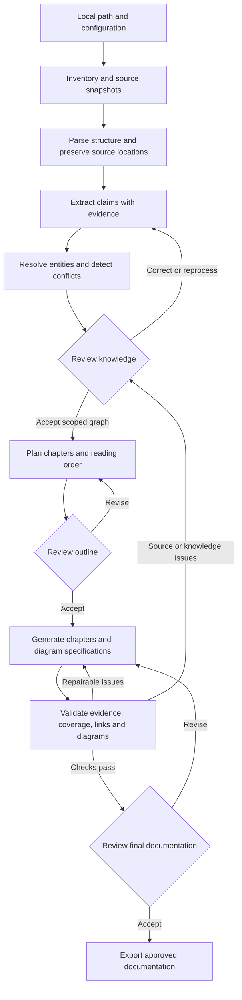

# Legacy documentation pipeline development plan

Build a local Python pipeline that turns legacy Markdown specifications into an evidence-backed knowledge graph, then uses that graph and its source passages to write readable English documentation for new customers. The documentation must explain available capabilities, their use, and what customers need to provide to implement them. Use LangGraph to orchestrate the workflow, Gemini API for model calls, and a terminal interface for human review. Include an interactive internal graph preview; a small Streamlit review interface can follow the terminal workflow.

The central design decision is to preserve claims and their evidence, including conditions and exceptions. A graph of entity names and relationships alone is insufficient for reconstructing reliable prose. Every published factual statement and meaningful diagram relationship must remain traceable to a versioned source passage.

Status: first-release implementation added on 7 October 2026. The Python CLI implements the eleven-stage workflow, evidence records, image inventory, persistent reviews, reset/purge, graph preview and customer/audit exports. See [operating instructions](../README.md), [implementation checklist](implementation-plan.md) and [evaluation status](evaluation.md). Offline verification is implemented; real Gemini quality/usage evaluation and domain-review acceptance remain outstanding. The supplied synthetic corpus has three Markdown files and no image references. Optional M6 work remains deferred. Acceptance targets below are still proposals, not measured quality claims.

## Scope and definition of done

The first release accepts a local Markdown file or directory of Markdown files and referenced images, preserves source snapshots, extracts structured content, builds a reviewable knowledge graph with an interactive preview, proposes a reading order, and exports English Markdown chapters with Mermaid diagrams and traceability records.

The release is complete when a representative corpus can pass through this workflow, a reviewer can resolve uncertain information and approve the result, a stopped run can resume after process restart, and published content passes the provenance and quality checks described below. Every run must expose the saved input and output of each explicit stage. The operator must also be able to clear selected stage results and restart from a clean stage without repeating valid upstream work.

The user confirms that all supplied specifications describe functionality that is available to new customers. Treat this as corpus-level context, without adding a separate availability approval gate. The pipeline still preserves conflicting implementation details and missing prerequisites. It does not verify behavior against code or a running system.

### Initial assumptions

- Single operator, local execution, one active worker per run.
- Accept Markdown only; upstream conversion is the user's responsibility. Support the Markdown conventions present in the corpus, including tables and image references.
- Keep the graph as an internal artifact with JSON export and an interactive local HTML preview. It is not a customer-facing deliverable.
- Configure the audience as new customers and the output language as English. Define glossary, scope and writing style explicitly. Preserve original source excerpts in their original language.
- Use Gemini API for every generative model call. Keep the model ID configurable and select it through a corpus evaluation, rather than fixing an untested model in this plan.
- Route every model call through LangChain within the LangGraph workflow. Store every application prompt in its own external file; never embed prompt text in Python code.
- Keep implementation small, readable and testable. Use shared services, singletons or decorators only where they remove concrete duplication without hiding workflow state.
- Keep input documents unchanged. Write run data and generated documentation into separate output directories.

### Deferred capabilities

Defer multiuser review, hosted services, a dedicated graph database, general document chat, automatic website publishing and code analysis. PDF, DOCX and HTML document conversion are outside scope. Referenced-image inventory and processing are part of the first release; do not silently drop knowledge that exists only in an image.

## Proposed architecture

LangGraph manages execution and review transitions. The knowledge graph is application data persisted separately from workflow checkpoints. Model calls follow the required path: LangGraph node → LangChain prompt/model runnable → `ChatGoogleGenerativeAI` from `langchain-google-genai` → Gemini Developer API. This LangChain integration supports structured output and image input. Application code must use that integration rather than calling the Google SDK or Gemini HTTP endpoints directly. [LangGraph overview](https://docs.langchain.com/oss/python/langgraph/overview), [LangChain Gemini integration](https://docs.langchain.com/oss/python/integrations/chat/google_generative_ai).



Limit automatic repair attempts, initially to two per artifact. Persistent problems become review items instead of creating an unbounded loop. Draft artifacts remain inspectable even when final export is blocked.

### Component boundaries

| Component | Responsibility | Initial implementation choice |
| --- | --- | --- |
| Markdown ingestion | Parse documents and resolve image references without losing structure or locations | Markdown syntax tree with source positions and corpus-tested table support |
| Domain models | Validate sources, claims, graph records, review decisions and chapters | Pydantic models with schema versions |
| Model integration | Structured Gemini calls, usage accounting and response validation | Shared LangChain `ChatGoogleGenerativeAI` factory and small runnable compositions |
| Prompt loading | Load, validate and version externally stored prompts | One YAML file per logical prompt, assembled into LangChain prompt templates |
| Workflow | State transitions, conditional routes, pauses and resumption | LangGraph `StateGraph` |
| Knowledge storage | Versioned entities, claims, evidence, relationships and decisions | SQLite plus immutable JSON exports |
| Checkpoint storage | Persist execution state across restarts | Separate local SQLite checkpoint database |
| Run artifact storage | Persist stage inputs, outputs, attempts and dependencies; support inspection and reset | Versioned files plus a run manifest, separate from checkpoints |
| Authoring | Evidence selection, chapter composition and diagram specifications | Explicit workflow nodes and versioned prompts |
| Rendering | Markdown, relative source links and Mermaid source | Deterministic renderers |
| Review interface | Show evidence, collect decisions and resume runs | CLI first, optional Streamlit later |
| Graph preview | Browse capabilities, dependencies and evidence | Local HTML visualization with search, filters and a details panel |

Use a Markdown parser that retains line positions. Select and pin the parser during M0 after testing table extensions, inline HTML and image syntax against the corpus; a general document conversion framework is unnecessary for this scope.

## Code quality and implementation size

Prefer small functions, explicit typed inputs/outputs and composition. The component table defines responsibilities, not a requirement to create a class, service layer or package for every row. Start with a few cohesive modules and split them only when the implementation warrants it. Avoid speculative provider abstractions, generic plugin frameworks and inheritance hierarchies for a pipeline with one model provider.

Centralize repeated model setup, prompt loading and stage artifact recording. A singleton or configuration-keyed cached factory may reuse a model client or immutable settings within one process when useful; keep dependencies injectable and replaceable in tests. Never store run state, review decisions, mutable graph data or stage outputs in a global singleton. Reusing a client must not defeat stage reset or mix model settings between runs.

Use a small decorator or context manager for repeated stage input/output recording, timing and error metadata where it makes node code clearer. Keep routing, dependencies, review pauses and reset behavior explicit. Such wrappers must preserve function metadata and LangGraph interrupt propagation, and must not turn a paused node into a failure or successful completion. Do not stack independent retry wrappers that multiply API attempts; assign retry responsibility once and expose its bounded policy.

Use the capabilities already provided by LangGraph and LangChain before adding custom orchestration or model wrappers. Apply formatting, linting and type checks, with focused tests for provenance, persistence, resets and prompt loading. Review code size through unnecessary duplication and abstraction rather than an arbitrary line limit or compressed one-line code. Pin dependencies and keep the package layout proportional to the implemented milestone.

## Prompts as external files

Each logical prompt lives in its own version-controlled file under `src/docgen/prompts/`. Use one YAML file containing role-tagged message templates, declared variables and a prompt ID; separate system and user messages can belong to the same logical prompt file. Extraction, image analysis, reconciliation, outlining, chapter composition, diagram planning, semantic review and repair each have their own file when implemented.

No application-authored model instructions, few-shot examples, repair messages or fallback prompts may be embedded as Python string literals, f-strings, constants or docstrings. Code supplies prompt IDs and structured runtime data, loads files, validates variables and constructs LangChain templates. Keep natural-language schema guidance sent to the model in external resources as well; structural Pydantic types and validation logic remain in code. Source excerpts and reviewer input are runtime data, not instruction templates.

Use one prompt loader that fails clearly for a missing file or unresolved variable. There must be no hidden inline fallback. Package prompt files with the application and resolve them as package resources so execution does not depend on the working directory. A cache, if used, must account for prompt content changes.

For every model call, persist the prompt ID, file content hash, a snapshot of the exact template, supplied variables or immutable artifact references, and rendered messages in the stage attempt. Include prompt hashes in stage cache keys. Changing a prompt invalidates all stages that consume it and their dependents; unaffected upstream work remains reusable. Diagnostic copies in run artifacts preserve the historical prompt without moving its source of truth into Python code.

## Evidence and knowledge model

Use claims as first-class records. A claim expresses a small factual assertion, potentially involving multiple entities, together with scope, version, conditions, exceptions and evidence. Graph edges may reference claims; they must not create unsupported knowledge of their own.

| Record | Essential fields |
| --- | --- |
| `SourceDocument` | Logical document ID, snapshot ID, relative path, content hash, format, declared version/date if available |
| `SourceSpan` | Span ID, snapshot ID, locator, exact excerpt, normalized content reference, parser version, extraction warnings |
| `ImageAsset` | Asset ID, content hash, local snapshot, referencing Markdown spans, caption/alt text, analysis status |
| `EvidenceRef` | Typed reference to a text span, image asset with its referencing span, or attributed reviewer statement; optional image region |
| `Entity` | Stable ID, type, canonical name, aliases, scope/version, evidence references |
| `Claim` | ID, assertion, entity IDs, conditions, exceptions, scope/version, evidence references, status |
| `Relationship` | ID, subject/object entity IDs, relation type, supporting claim IDs, direction |
| `Conflict` | Competing claim IDs, conflict type, resolution status, recorded decision |
| `ReviewDecision` | Decision ID, artifact revision, reviewer, timestamp, action, rationale, accepted patch |
| `ChapterPlan` | Chapter ID, reader question, prerequisites, learning outcome, required claim IDs, uncovered topics |
| `GeneratedBlock` | Block ID, content, claim IDs, evidence IDs, content type, validation results |
| `DiagramSpec` | Diagram ID, node/edge definitions, supporting claim IDs, diagram type |
| `StageAttempt` | Run ID, execution ID, stage ID, attempt ID, dependency revisions, status, input/output references and hashes, configuration, timestamps, usage, error and checkpoint reference |

Begin with a vocabulary aligned to customer decisions: capability, business scenario, actor, process, customer input, prerequisite, integration, configuration and constraint. Proposed relationships include `enables`, `requires`, `provided_by`, `integrates_with`, `depends_on`, `produces` and `precedes`. Review domain-specific additions instead of allowing arbitrary new labels on every extraction.

Represent a customer obligation separately from a general dependency: what must be supplied, by whom, in what format, and at which stage. Preserve whether a requirement is mandatory, optional or conditional. If these details are absent, record them as unknown; do not infer them from typical implementations.

### Source location rules

Preserve file-relative paths, line ranges and heading paths in Markdown. Store table headers, units, captions, row/column coordinates and footnotes with extracted cells. For embedded HTML tables, retain cell spans if present. A row without its headers is not sufficient evidence. Image evidence points to an immutable image asset and the Markdown block that references it; add a region only when the extraction actually provides one.

An immutable source snapshot and content hash prevent citations from silently pointing to modified material. Locators refer to that snapshot. Across runs, compare document revisions explicitly; extraction IDs may change with source or parser versions.

### Traceability in generated documentation

The required chain is:

```text
Generated sentence or block
  -> supported claim(s)
  -> text span(s), image evidence or attributed reviewer statement
  -> locator inside a specific source snapshot or versioned review record
```

Render ordinary relative Markdown links to an evidence appendix in the internal review edition, keeping exact excerpts, images and source locations accessible. Put the detailed mapping in `provenance.json`. A block containing several assertions needs separate mappings or must be split into smaller blocks. Diagram edges use the same evidence chain, with a caption or companion evidence list.

Keep the customer edition readable and preserve its block IDs in the matching internal provenance manifest. By default, package the full source excerpts in a separate internal audit bundle; allow an evidence appendix in the customer edition when desired. Final review chooses any legacy images to include in the customer bundle, because a screenshot can contain details unrelated to the new customer's installation. Both editions derive from the same approved content revision.

For example, if a source table says "three attempts, only for transient errors", the claim must preserve both the number and the condition. The generated instruction must not become "retry every failure three times". This is a proposed evaluation fixture, not a fact about the user's system.

Validate that referenced spans exist and quotations match extracted source text. Then assess whether the passages actually support the assertions. Valid IDs and matching quotations establish reference integrity, not semantic correctness.

Maintain distinct statuses for extracted candidates, accepted claims, conflicts, rejected claims and unresolved items. Model confidence can prioritize review but cannot establish truth. Human factual additions require their own attributed evidence record; ordinary approval must not turn an unsupported assertion into a source-backed fact.

## Workflow behavior

### Inventory and parsing

Resolve the chosen path, build a manifest, show file counts and formats, and report unsupported or unreadable files explicitly. Exclude the output directory from discovery. Keep discovery within the selected root unless the operator deliberately includes additional paths.

Create structural blocks before chunking. Chunk by sections, tables and procedures with bounded context and stable source references. Carry necessary headings and cross-references into extraction input. Record missing destinations instead of inventing their content.

### Referenced images

Resolve relative and reference-style image links against the containing Markdown file, inventory embedded HTML image tags, and deduplicate local assets by content hash. The initial supported image files should be PNG, JPEG and WebP; report other formats for preprocessing. Default to local assets. Flag remote references for localization or explicitly configured retrieval, rather than silently ignoring them or assuming network access.

Preserve the image, alt text, caption and surrounding section. Classify each image as decorative, illustrative or potentially carrying unique factual content. Use Gemini image understanding for screenshots, diagrams and other informative images; Gemini accepts image input alongside text. [Gemini image understanding](https://ai.google.dev/gemini-api/docs/image-understanding).

Store model interpretations as candidate claims tied to the original image, not as exact quotations. Review image-only claims and disagreements between text and images. A missing, unreadable or low-resolution informative image creates a visible gap; do not guess labels, ordering or values. Record whether each image was analyzed, excluded with a reason or left unresolved.

### Extraction and graph construction

Ask Gemini for small structured batches of entities, claims and evidence selections. Use application-assigned source span IDs and validate every returned reference against the supplied batch. Gemini structured output supports a subset of JSON Schema; syntactic validity does not ensure correct meaning, so validate both values and evidence in application code. [Gemini structured outputs](https://ai.google.dev/gemini-api/docs/structured-output).

Resolve aliases using names, scope and evidence. Avoid merging two similarly named components from different versions. Record explicit merge/split decisions. Preserve contradictory assertions and their sources; use reviewed authority/version rules to resolve them rather than assuming the newest filename is authoritative.

Create a coverage ledger for every source block: represented by claims, intentionally excluded with a reason, duplicate, or unresolved. This catches material lost before generation, which chapter citation checks alone cannot detect.

### Knowledge and outline review

The knowledge review presents conflicts, ambiguous entity merges, extraction warnings, unsupported claims and a sample of accepted claims next to source excerpts. The operator can approve, correct, reject, defer or request re-extraction. Deferred information remains listed as a gap and is not asserted as fact in the final text.

Generate an outline organized around customer understanding: business context, capability groups, example scenarios, how capabilities work together, implementation preparation, limitations and a glossary. Lead with what a capability enables and when to use it. Make prerequisites explicit. The outline review establishes scope and reading order before full chapters are written.

### Customer chapter contract

Each capability chapter answers these questions in connected English prose, with short lists where useful:

1. What does this capability do, and which customer scenario does it support?
2. Who uses it, and how does the main process work?
3. What options or variations are available?
4. What must the customer provide: data, access, decisions, configuration, integrations or other inputs?
5. What dependencies, conditions and limitations affect implementation?
6. What still needs clarification before implementation can be planned?

Only include a benefit, option, requirement or example behavior when supported by the source. Avoid implementation-ticket chronology, internal abbreviations without explanation, undocumented delivery estimates and marketing promises. A capability is available without necessarily being deployable for every customer without configuration or prerequisites.

Add a consolidated customer preparation checklist across chapters. Deduplicate shared requirements without losing which capabilities and conditions require them. Where a specification does not describe preparation needs, say that they are not specified; never turn absence into "no preparation required".

### Composition and diagrams

Build each chapter's evidence bundle from its planned claims, relevant graph neighbors and original supporting passages. Fit bundles to an explicit context budget. Start with graph traversal and text lookup; add embedding retrieval only if measurements show a need.

Compose chapters from structured blocks: introductory explanation, factual explanation, steps, cautions, examples and summaries. Mark illustrative examples as illustrative and prevent them from introducing undocumented system behavior. Keep reference tables when tabular lookup helps; explain their meaning and move extensive detail to appendices.

Generate diagram specifications from supported relationships and render them to Mermaid deterministically where feasible. A dependency graph cannot justify a sequence diagram unless the source also supports ordering and interactions. Mermaid is a text-based diagram tool with multiple diagram types. Validate generated syntax with a pinned renderer during implementation. [Mermaid introduction](https://mermaid.js.org/intro/).

### Validation and final review

Check source coverage, factual support, retained conditions and exceptions, glossary consistency, chapter dependencies, dead links and Mermaid parsing. Use Gemini for a separate semantic review pass, but treat it as a detector of possible problems, not an independent ground truth.

Present the rendered chapters, evidence links, remaining gaps, validation report and diff from any previous draft to the operator. Final approval binds to the exact artifact revision. Any later edit affecting content invalidates the relevant checks and approval.

## Interactive graph preview

Include a local, read-only HTML preview in M3. Use colors for entity types, a legend, labels, zoom, search and filters by capability and review status. Selecting an entity or relationship shows its claims and source excerpts or image evidence. Start with capability groups and allow expansion of a small neighborhood so a large corpus does not become an unreadable web of nodes.

A candidate renderer is `vis-network`, which supports interactive node/edge networks and configurable interaction. Package a pinned local frontend asset with the preview. This is a small visualization adapter around exported graph JSON; the workflow and knowledge logic remain in Python. [vis-network documentation](https://visjs.github.io/vis-network/docs/network/).

Keep edits in the CLI review workflow initially. A graph database, a custom graph editor and an independent graph product are outside the first release. The preview is for checking extracted knowledge before composition; customer Mermaid diagrams show selected concepts and processes rather than the full knowledge graph.

## Human review and resumability

Implement review as workflow state, not as `input()` embedded in business logic. LangGraph provides `interrupt()` and `Command(resume=...)`; resumption uses the same `thread_id`, and the interrupted node runs again from its beginning. Keep model calls and non-idempotent writes outside review nodes. [LangGraph interrupts](https://docs.langchain.com/oss/python/langgraph/interrupts).

Persist review requests and validated decisions with artifact revision IDs. A terminal command can display the request and submit a decision; a future Streamlit form calls the same service. Reject decisions for outdated artifact revisions. Define defer, cancel and retry as explicit run transitions.

Use a persistent SQLite checkpointer for local development; an in-memory saver cannot survive process restart. Keep checkpoint state compact: run ID, artifact references, current stage, review IDs, counters and errors. Store documents and the knowledge graph outside checkpoint payloads. [LangGraph persistence](https://docs.langchain.com/oss/python/langgraph/persistence).

Use content hashes and stage configuration hashes to reuse completed artifacts. Record model ID, prompt/schema/parser versions and generation parameters. Commit outputs atomically. Recovery must avoid duplicate accepted claims and duplicate exports, while acknowledging that an API request whose outcome was lost may be charged again on retry. Exact regeneration of model prose is not guaranteed; retain the original responses for audit.

## Stage artifacts and clean restarts

Make stage boundaries part of the application contract. A run such as `run-001` has a manifest listing every planned stage, its dependencies, status and attempts. A stage may contain multiple LangGraph nodes or model requests; persist those requests under the stage attempt so the operator can inspect how its result was produced. Workflow checkpoints support execution recovery, while stage artifacts provide a stable, readable audit record.

### Explicit stage boundaries

| Stage ID | Saved input | Saved output |
| --- | --- | --- |
| `inventory` | Selected path and run configuration | Source and image snapshots, file manifest and discovery warnings |
| `parse` | Inventory revision and parser configuration | Markdown blocks, tables, image references, locations and parse warnings |
| `extract` | Parsed blocks, image assets, extraction prompts and schemas | Candidate entities, claims, evidence and image interpretations |
| `reconcile` | Extraction results and resolution rules | Knowledge graph revision, aliases, conflicts and coverage ledger |
| `review_knowledge` | Graph revision, evidence and review request | Recorded decisions and accepted graph revision |
| `outline` | Accepted graph, audience and writing configuration | Chapter plan and required claims per chapter |
| `review_outline` | Proposed outline and review request | Decisions and approved outline revision |
| `compose` | Approved outline and chapter evidence bundles | Structured chapter blocks, diagram specifications and draft Markdown |
| `validate` | Draft revision, source mappings and validation configuration | Validation results, coverage findings and repair requests |
| `review_documentation` | Validated draft, reports and review request | Decisions and approved documentation revision |
| `export` | Approved revision and export configuration | Customer and audit bundles with checksums |

Each repair loop or explicit rerun creates a new attempt; it does not overwrite the previous attempt. Save per-chapter and per-batch artifacts within their stage attempts. The initial reset granularity is a whole stage; selective regeneration of individual chapters can follow in M6. Graph previews are derived artifacts attached to a specific graph revision.

### What is saved for each attempt

Write `input.json` before executing the stage. It contains the stage's complete effective input, including resolved configuration and references to immutable upstream artifacts. Large text, graphs and images can be stored separately, but references must resolve to locally retained content with hashes; paths to mutable source files alone are insufficient.

Save `output.json` only when a result is committed successfully. Save failed or incomplete results separately as partial artifacts and record the error. A review pause has a persisted request and a `waiting_for_review` status; it must not masquerade as a completed stage. Each attempt also records start/end times, stage/code/schema/prompt versions, model settings, dependency attempt IDs, usage, validation findings and review decisions.

Persist application-sent model prompts and request settings, input asset references, and returned model content, including malformed responses needed for debugging. Remove API keys, authorization headers and other transport credentials. Keep this diagnostic material local to the run, separate from the customer export and routine operational logs.

Provide a run overview showing all stages and their statuses, followed by drill-down into each attempt's input, output, warnings, errors and model exchanges. JSON remains the authoritative representation; generate a readable local HTML or Markdown report and CLI summaries from it. The report must also work for failed, interrupted and partially completed runs. Mark invalidated, superseded, missing and purged artifacts explicitly.

### Resume, reset and removal

`resume` continues the current execution using valid persisted state. `reset --from <stage>` instead clears the selected stage and its transitive dependents from the active results, invalidates their review approvals and caches, and marks them pending. Keep independent and upstream stages available. Determine affected stages from recorded dependencies, not filename ordering alone.

By default, reset retains old attempts for inspection but makes them inactive. An explicit `--purge` option physically removes the affected generated attempt payloads and derived previews from that run; retain a small manifest tombstone describing what was removed. Do not delete input originals, retained source snapshots, unaffected upstream artifacts or previously exported bundles. Exports based on invalidated results remain historical and cannot be presented as the current approved output. Shared payloads still referenced by retained attempts or exports must remain available; report them as retained references.

Reject reset while a worker is running; the operator can stop the worker first. Apply invalidation as one consistent manifest update and make interrupted cleanup recoverable. After reset, start a new execution ID and LangGraph thread under the same logical run, initialized only from valid upstream artifacts. Do not resume an old checkpoint that could restore removed state. Force fresh execution of reset stages, bypassing application caches; a deliberate reset of a model stage issues new model requests.

If a prerequisite is missing, corrupt or incompatible with the requested configuration, report the earliest stage that must be rebuilt. Detect manually deleted stage files on inspection or resume and propagate invalidation before proceeding. A change to a prompt or stage configuration invalidates that stage and its dependents; a change to the source snapshot requires a new inventory revision. Preserve lineage so results from different configurations cannot be silently mixed.

For example, after `run-001` finishes, the operator can inspect the graph and then reset from `compose`. Inventory, parsing, extraction, accepted knowledge and the approved outline remain valid. Composition, validation, final review and export run again with fresh attempts. Resetting from `extract` also rebuilds the graph and requires renewed knowledge and outline review.

Proposed inspection and reset commands:

```text
docgen stages run-001
docgen show run-001 --stage extract --attempt 1
docgen report run-001
docgen reset run-001 --from compose --dry-run
docgen reset run-001 --from compose
docgen resume run-001
docgen reset run-001 --from extract --purge
docgen resume run-001
```

The dry run lists affected stages, approvals, cache entries and payloads before a reset. These commands are implemented by the CLI.

## Gemini integration and operating limits

Keep LangChain compositions narrow: externally loaded prompt templates, the configured `ChatGoogleGenerativeAI` model, and structured output validation where needed. Invoke them from LangGraph nodes for text/image extraction, outline generation, chapter composition and semantic review. Preserve returned model content alongside parsed results for stage inspection. Return model metadata, finish status and usage statistics with the result. Distinguish transport errors, quota exhaustion, blocked/empty responses, truncation and schema violations. Use the Gemini Developer API backend explicitly and keep Google SDK use internal to the LangChain integration. [LangChain Gemini integration](https://docs.langchain.com/oss/python/integrations/chat/google_generative_ai).

Use bounded retries with backoff for transient failures, concurrency limits, per-stage output limits and a run budget. Rate limits depend on the project usage tier and model, so configure them from the actual account rather than hardcoding assumed capacity. [Gemini rate limits](https://ai.google.dev/gemini-api/docs/rate-limits).

Local file selection does not imply local model inference: selected source excerpts and informative images are sent to Gemini. Configure which input paths may be processed, keep API keys outside repository files, and avoid raw source text in routine logs. Treat document text and image content as data; they must not change workflow instructions or cause tool execution. These controls address direct properties of this pipeline, not a separate compliance workflow.

## Proposed artifacts and package layout

```text
src/docgen/
  cli.py
  config.py
  models/
  ingestion/
  knowledge/
  llm/gemini.py
  llm/prompts.py
  prompts/
    extract_claims.yaml
    analyze_image.yaml
    reconcile_entities.yaml
    plan_outline.yaml
    compose_chapter.yaml
    plan_diagram.yaml
    review_semantics.yaml
    repair_output.yaml
  workflow/
  authoring/
  validation/
  review/
  preview/
tests/
  fixtures/
  unit/
  integration/
  evaluation/
runs/<run-id>/
  manifest.json
  events.jsonl
  report/
  stages/<stage-id>/attempts/<attempt-id>/
    metadata.json
    input.json
    output.json
    artifacts/
    model-calls/
    review.json
    error.json
  sources/
  assets/
  normalized/
  knowledge.json
  graph-preview/
  review-decisions.jsonl
  outline.json
  provenance.json
  validation.json
  usage.json
  draft/
output/<revision>/
  customer/
    README.md
    chapters/
    customer-preparation.md
    diagrams/
    assets/
  audit/
    evidence/
    provenance.json
    coverage.json
```

Package the cited excerpts, referenced image evidence and source metadata in the audit bundle so its links remain usable after moving the output folder. The audit manifest maps to the customer edition's block IDs and revision hash. Original Markdown snapshots stay in run storage unless explicitly included in the export. Clearly label that difference in the evidence appendix.

Stage attempt directories are the authoritative history. Run-level files such as `knowledge.json` and `outline.json` are convenience views of the active successful attempts and must be invalidated or rebuilt with them. Conditional files such as `review.json` and `error.json` exist only where applicable; `output.json` is absent until successful completion. The source layout is illustrative: create only modules and prompt files needed by the current milestone, retaining the separate-file rule for every prompt.

Implemented commands include `docgen inspect <path>`, `docgen run <path> --config <file>`, `docgen review <run-id>`, `docgen resume <run-id>` and `docgen export <run-id>`. See the repository README for review-decision files, prerequisites and configuration.

## Development milestones

Complete one small vertical slice before expanding corpus scale or building the graph preview. Each milestone ends with inspectable artifacts and an acceptance check.

| Milestone | Work | Acceptance check | Depends on |
| --- | --- | --- | --- |
| M0 Corpus and evaluation baseline | Select representative Markdown, images and a target customer chapter; annotate claims, prerequisites, exceptions and conflicts | A reviewed fixture set and agreed quality rubric exist | User corpus and domain reviewer |
| M1 Full workflow prototype | Markdown ingestion, domain schema, LangChain Gemini integration, external prompt loader, minimal graph, one English chapter, citations, CLI review, persistent checkpoint and stage artifact contracts | One real Gemini run through LangGraph/LangChain produces a reviewed chapter; prompts are external; stage artifacts, resume and reset from composition work | M0 |
| M2 Markdown and image provenance | Table handling, image resolution and multimodal extraction, immutable snapshots, locator validation and source coverage ledger | Text and image claims trace to correct sources; missing assets and skipped material are reported | M1 |
| M3 Knowledge review and visualization | Entity aliases, version scope, conflicts, merge/split review, graph revisions and interactive HTML preview | Reviewers can filter capabilities and inspect evidence; seeded conflicts remain visible and rejected claims cannot reach approved output | M2 |
| M4 Customer documentation | Outline review, capability chapters, consolidated preparation checklist, glossary, diagrams and customer/audit editions | A reader can explain a capability, identify its prerequisites and list what the customer must provide | M3 |
| M5 Release hardening | Semantic checks, bounded repair, error recovery, budgets, stage reset/purge integrity, run reports, export integrity and operating documentation | Acceptance suite passes, reset cannot reuse stale results, and a representative corpus receives final review | M4 |
| M6 Optional usability and updates | Small Streamlit review form; dependency-based regeneration and draft diffs | Both interfaces submit the same decisions; changed sources flag affected chapters for renewed review | M5 |

M1 proves feasibility; M0 through M5 define the first usable release. Estimate calendar time after M0, because Markdown complexity, image content, document volume and reviewer availability dominate uncertainty.

### Immediate work queue

- [x] Confirm Markdown input with images, new-customer audience, English output, available functionality and internal graph preview.
- [x] Require explicit stage boundaries, persisted inputs/outputs, run inspection and clean restarts after clearing stage results.
- [x] Require compact, maintainable code, one external file per prompt, and Gemini access through LangGraph/LangChain.
- [x] Measure corpus size and inspect Markdown conventions and image locations.
- [ ] Select a small representative corpus with a large table, informative image, cross-reference, customer prerequisite, exception and conflicting statement where available.
- [ ] Agree one target chapter and annotate the evidence it must retain.
- [x] Define the initial Pydantic models and source locator contract.
- [x] Define stage contracts, attempt manifests and dependency invalidation before implementing workflow nodes.
- [x] Add the shared LangChain model factory and external prompt loader with prompt hashing and package-resource loading.
- [ ] Implement the M1 vertical slice and record baseline quality, latency and token usage.

## Verification and release criteria

Use deterministic unit tests for locators, table context, schema checks, graph identity, conflict handling and provenance links. Use fixture-backed integration tests for transitions and injected failures. Keep a small explicit Gemini evaluation suite separate from routine offline tests.

The initial evaluation corpus should include duplicate names, different system versions, contradictory values, missing cross-references, negation, units, exceptions, conditional customer requirements and instructions embedded inside source text. Include relative/reference-style image links, an informative screenshot, a decorative image, missing and unreadable assets, and conflicting text/image information. Test an empty directory, unsupported files, a failed parser, a malformed model response, rate limiting and process restart at review.

Proposed release criteria, to ratify in M0:

- All factual output blocks and meaningful diagram edges have valid claim-to-source mappings. Independent review checks for assertions omitted from those mappings.
- All source blocks have a coverage-ledger disposition. Every known critical source claim appears in the output or has an explicit reviewed exclusion.
- No unresolved critical conflict is presented as settled fact; remaining gaps are visible.
- On a manually annotated sample, at least 95% of extracted claims are supported and at least 90% of required claims are retained. These are initial targets, not measured results or guarantees.
- No critical factual error remains in the reviewed release sample. Critical means a wrong instruction, condition, value, dependency or version that would materially change a reader's action.
- Every exported local link resolves; every Mermaid diagram parses and is visually checked for readable labels and meaningful grouping.
- A domain reviewer gives at least 4 out of 5 for readability. A reader unfamiliar with the specifications can explain what a selected capability does and identify the customer inputs and prerequisites described in the sources.
- All generated customer obligations have evidence and retain their mandatory, optional or conditional status. Missing preparation information is visible, and the consolidated checklist agrees with individual chapters.
- Graph preview search, filters and selection lead to the correct source text/image; the preview works on a representative graph without requiring every node on screen.
- A restart test resumes the same run without duplicating accepted graph records or approved exports. Retry and budget exhaustion terminate or pause predictably.
- Every attempted stage has a persisted input, configuration and status. Successful stages have committed outputs; failed and paused stages expose their partial artifacts, errors or review requests. A completed run can be inspected without calling Gemini again.
- Resetting `compose` preserves valid upstream artifact hashes and creates fresh attempts for composition and its dependents. Old validation results and approvals cannot authorize the new output, and application caches cannot silently restore reset results.
- Resetting `extract` invalidates graph construction, its preview and all dependent documentation stages. Missing prerequisites, manual deletion and configuration changes produce the same dependency checks.
- Purge removes the selected generated payloads while preserving the removal record, required shared artifacts, source snapshots and historical exports. Recovery after an interrupted reset/purge leaves no invalid attempt active.
- All application model calls use the LangChain Gemini integration from LangGraph nodes, including image analysis, validation and repair. Application code contains no direct Google SDK or Gemini HTTP calls.
- Every application prompt has its own packaged file, and code review finds no embedded prompt text or inline fallbacks. Loader tests cover missing files, missing variables, loading outside the repository working directory and exact prompt snapshots in run artifacts. Editing a prompt invalidates its consuming stages and dependent results.
- Formatting, linting, type checks and relevant tests pass. Review confirms that shared helpers remove duplication, singleton scope cannot leak state between runs, and any stage decorator preserves review interrupts, failure recording and clean reset behavior.

Measure structural provenance coverage, semantic support, source coverage, review effort, elapsed time and API usage separately. A high citation percentage must never be presented as proof of factual accuracy.

## Main risks and responses

| Risk | Design response | Verification point |
| --- | --- | --- |
| Lost table semantics or misread image content | Preserve structural context, original images and extraction warnings | M0 corpus inspection and M2 locator fixtures |
| A lossy graph removes caveats | Store qualified claims plus original passages | Exception and negation fixtures |
| Conflicting versions get merged | Scope entities and claims; retain conflict records | M3 conflict review |
| Citations exist but do not support prose | Separate reference integrity from semantic assessment | Annotated claim audit and final review |
| Readable prose quietly omits important detail | Maintain source and chapter coverage ledgers | Required-claim recall and task scenarios |
| Customer requirements are invented or overstated | Preserve obligation conditions and flag missing preparation details | Customer-checklist audit in M4 |
| Review becomes too burdensome | Prioritize conflicts and high-impact claims, sample the remainder | Record review time during M1 and M4 |
| Large corpora exceed context or budget | Bounded batches, chapter bundles, artifact reuse and limits | Representative scale test before M5 |
| Restart or correction leaves stale approvals | Revision-bound decisions and downstream invalidation | Recovery and edit-after-approval tests |
| Reset restores deleted work from a checkpoint or cache | New execution thread, explicit dependency invalidation and fresh stage execution | Reset and purge acceptance tests |

## Decisions still needed

Corpus volume, Markdown conventions, image formats and local/remote image locations still need inspection during M0. Use local referenced images as the initial assumption. Corpus sampling should also establish precedence rules for conflicting details and identify which customer preparation topics are missing. These questions affect implementation sizing; they do not change the confirmed Markdown input, English output, customer audience or intermediate graph purpose.

## Sources

Official documentation consulted on 7 October 2026. The architecture, milestones and acceptance thresholds are project proposals.

- LangChain: [LangGraph overview](https://docs.langchain.com/oss/python/langgraph/overview).
- LangChain: [Interrupts](https://docs.langchain.com/oss/python/langgraph/interrupts).
- LangChain: [Persistence](https://docs.langchain.com/oss/python/langgraph/persistence).
- LangChain: [Gemini integration](https://docs.langchain.com/oss/python/integrations/chat/google_generative_ai).
- Google: [Structured outputs](https://ai.google.dev/gemini-api/docs/structured-output).
- Google: [Rate limits](https://ai.google.dev/gemini-api/docs/rate-limits).
- Google: [Image understanding](https://ai.google.dev/gemini-api/docs/image-understanding).
- vis.js: [vis-network documentation](https://visjs.github.io/vis-network/docs/network/).
- Mermaid: [Introduction](https://mermaid.js.org/intro/).
